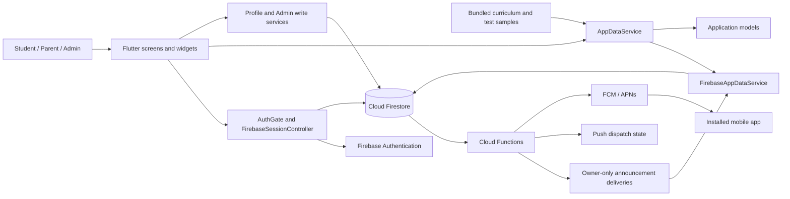
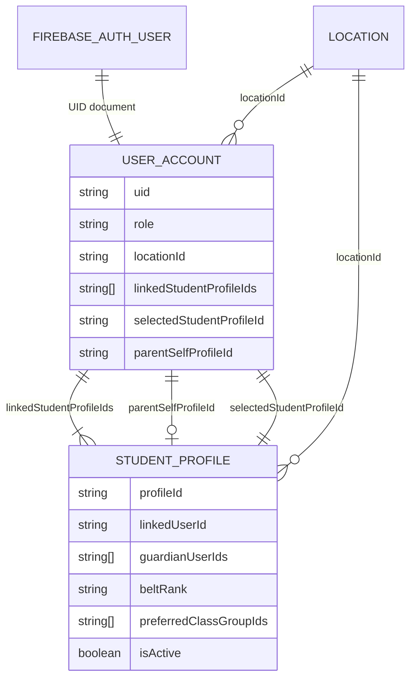

# Olympic Taekwondo Academy Management Platform

The Olympic Taekwondo Academy (OTA) Management Platform is a Flutter and Firebase mobile application for the academy's students, parents, and administrators. It brings schedules, student profiles, belt curriculum, announcements, events, resources, and academy administration into one role-aware system instead of leaving families and staff to assemble the same information from separate channels.

The repository contains the application and its production-oriented security and release configuration. It is **not evidence that the production backend has been deployed or that store releases are live**. Repository engineering is prepared for final integration; production deployment, signing, Apple/APNs setup, physical-device validation, store-console work, and final academy content approval remain controlled external steps.

This README is the authoritative product, architecture, history, security, and readiness narrative. Developers looking for a current file-by-file implementation map should continue to [the codebase guide](docs/CODEBASE_GUIDE.md).

## Table of contents

1. [Project overview](#project-overview)
2. [Background and motivation](#background-and-motivation)
3. [Goals and product principles](#goals-and-product-principles)
4. [User roles](#user-roles)
5. [Complete functionality tour](#complete-functionality-tour)
6. [Development journey](#development-journey)
7. [Design decision history](#design-decision-history)
8. [System architecture](#system-architecture)
9. [Flutter application architecture](#flutter-application-architecture)
10. [Authentication and account model](#authentication-and-account-model)
11. [Family and student profile model](#family-and-student-profile-model)
12. [Firestore data model](#firestore-data-model)
13. [Firestore security model](#firestore-security-model)
14. [Announcements and notification architecture](#announcements-and-notification-architecture)
15. [Schedule and preferred classes](#schedule-and-preferred-classes)
16. [Curriculum](#curriculum)
17. [Events and resources](#events-and-resources)
18. [Account deletion](#account-deletion)
19. [Development and production environments](#development-and-production-environments)
20. [Android build and release architecture](#android-build-and-release-architecture)
21. [iOS build and release architecture](#ios-build-and-release-architecture)
22. [Cloud Functions](#cloud-functions)
23. [Testing and validation](#testing-and-validation)
24. [CI and release automation](#ci-and-release-automation)
25. [Production readiness](#production-readiness)
26. [Known limitations and future work](#known-limitations-and-future-work)
27. [Project structure](#project-structure)
28. [How to run and develop](#how-to-run-and-develop)
29. [Current status](#current-status)

## Project overview

OTA is a community academy with several kinds of people interacting with the same training program:

- students need the class schedule, their current belt progress, curriculum, announcements, events, and useful links;
- parents need one account from which they can manage themselves and one or more children;
- location administrators need controlled tools for schedules, communications, events, resources, and student progress; and
- a Super Admin needs to work across academy locations without weakening location isolation for everyone else.

The application targets Android and iOS. Flutter supplies a shared UI and application layer; Firebase Authentication supplies login identity; Cloud Firestore stores academy and account data; Cloud Functions calculate authorized announcement recipients and send publication notifications; and Firebase Cloud Messaging (FCM), with APNs on iOS, carries push notifications.

The current product supports four roles—Super Admin, Admin, Parent, and Student—and does **not** use an account-approval workflow. Public signup creates an active Parent or Student account immediately. Access is then constrained by authentication, active state, exact profile ownership, academy location, selected profile, role, and strict Firestore document rules.

## Background and motivation

The project was created as a long-term management and communication platform for Olympic Taekwondo Academy. The repository history begins with a Flutter shell and static screens, but the product problem is broader than displaying an academy website inside an app.

Academy information changes over time and has different audiences. A schedule must be centralized and reflect recurring class groups. An event may require a registration resource. Curriculum should remain available even when a network connection is unreliable. A parent may need different class guidance for different children. An announcement for one belt, class group, or student should not become readable merely because the UI hides it. Administrators need to manage those records without gaining unrestricted access outside their assigned location.

Those needs shaped the current architecture:

- account identity is separated from training profiles so one parent login can represent a family;
- academy records carry a `locationId` so expansion does not require replacing the data model;
- operational content is live in Firestore while curriculum remains bundled in the app;
- administrators write canonical schemas through focused services;
- Firestore Rules enforce authorization independently of what Flutter displays; and
- server-side delivery documents protect targeted announcement content.

## Goals and product principles

| Principle | How the current product applies it |
| --- | --- |
| Simple member access | Authenticated Parent and Student accounts become active immediately; there is no membership-review queue. |
| Family profiles without duplicate logins | A Parent owns one account and one or more linked student profiles, including an optional self profile. |
| Role-based administration | Public signup cannot choose Admin roles. Admin and Super Admin access comes from authoritative Firestore account records. |
| Location isolation | Member content, administrator reads/writes, profile ownership, and selected-profile access are tied to active academy locations. |
| Secure communication | Everyone announcements are readable at the source; targeted content is copied into owner-only delivery documents after server authorization. |
| Cross-platform delivery | Flutter shares the Android/iOS application while native flavors, bundle IDs, Firebase files, signing, and platform capabilities remain explicit. |
| Reliable curriculum | Belt curriculum is bundled and read-only rather than adding Firestore availability and administration complexity. |
| Canonical writes with legacy-safe reads | Current admin writes use strict schemas; narrowly identified legacy values remain readable or archivable where removing compatibility would strand records. |
| Bounded backend work | Queries, Rules access calls, deletion steps, Function instances, FCM batches, and Firestore batches are deliberately bounded. |
| Controlled production change | Repository configuration does not authorize billing changes, Firebase deployment, signing-key handling, or store publication. |

Multi-location support is architecturally real, but the operational academy workflow and content are still centered on OTA Cheshire. Advanced reporting, attendance, messaging, and signed store publishing are not current features.

## User roles

Authentication identifies a Firebase user. The `users/{uid}` document determines the OTA role and account scope.

| Role | Scope and data visibility | Profiles and location behavior | Main capabilities |
| --- | --- | --- | --- |
| **Student** | Active academy content for the account's location and private per-account state | Owns one self profile: `linkedUserId` is the UID and `guardianUserIds` is empty | Dashboard, schedule, one preferred class group, curriculum, announcements, events, resources, profile editing, and member account deletion |
| **Parent** | Active academy content for the family account's location and private per-account state | Owns child profiles whose sole `guardianUserIds` entry is the parent UID; may also own one self profile | Member experience plus profile switching, child creation/editing/removal, and optional parent self-profile creation |
| **Admin** | Users, profiles, schedule, announcements, events, and resources for one assigned active location | Does not use a selected student profile for administration | Location dashboard; class-session CRUD; announcement publishing/targeting; event/resource CRUD; student belt/sticker progress updates |
| **Super Admin** | Controlled cross-location access to active locations | Selects an active location for writes while retaining broader administrative visibility | Admin capabilities across locations and controlled privileged-account/location scope |

A Parent account and a student profile are deliberately different concepts. The account is the login, contact, role, location, and private notification boundary. A student profile is a person who trains: it contains birth date, belt/sticker progress, class preference, and ownership relationships. This separation lets one parent manage several training identities without sharing passwords or creating a Firebase login for each child.

## Complete functionality tour

### Authentication and onboarding

The welcome screen leads to login or signup. The application supports email/password, Google, and—on supported Apple platforms—Sign in with Apple. Password reset is sent through Firebase. Signup enforces an eight-character application minimum; the Firebase Console must separately enforce the matching policy.

After Firebase Authentication succeeds, `AuthGate` resolves the OTA account state. A new user with no `users/{uid}` document completes profile creation. Public onboarding permits Student or Parent roles, requires the account holder to be at least 16, selects an active location, and creates the account plus all initial profiles in one Firestore batch. There is no email-verification or academy-approval gate in the current flow.

Students create one self profile. Parents can create a self profile and up to ten additional students, or create one through ten children without a self profile. If the parent delays creating a self profile, account-holder form values can be kept in `studentProfileDefaults` and reused later.

### Member experience

- **Dashboard:** Greets the account holder, shows the selected student, switches family profiles, calculates belt/sticker progress, surfaces the next eligible class, and previews academy updates/events.
- **Schedule:** Provides day/week views of active recurring `classSessions`, localizes times to the academy, shows eligibility, and saves or clears one preferred recurring class group.
- **Curriculum:** Displays the bundled belt order and five canonical requirement sections. Each form may have its own optional YouTube video; missing media shows a safe unavailable state.
- **Announcements:** Merges same-location Everyone announcements with server-authorized targeted deliveries, deduplicates by ID, and displays category, importance, action-needed state, and full detail.
- **Read state:** Creates or deletes private `notificationReads` documents for one, unread, or mark-all operations. State belongs to the account and persists across profile switching.
- **Events:** Presents published, non-archived events in an academy-local month calendar. Multi-day events appear on each spanned local date; a live detail sheet becomes unavailable if access disappears.
- **Resources:** Presents published, non-archived General Resources, validates HTTP/HTTPS links, and provides copy/open actions.
- **Profiles:** Shows account and selected-student data. Members update account name, edit owned student data, manage family profiles, switch profiles, and choose a preferred class.
- **Family management:** Parents add children, create their own one-time self profile, edit owned profiles, and unlink/deactivate a profile while keeping at least one active student.
- **Account deletion:** Parent and Student accounts permanently delete private state, every owned profile, the Firestore account, and Auth identity after provider-specific reauthentication.

### Administrator experience

- **Dashboard** summarizes records in current administrator scope.
- **Students** lists location-scoped accounts/profiles, explains self/child relationships, and writes belt plus sticker progress with a canonical next-rank value.
- **Announcements** creates, edits, publishes, archives, and deletes records. Current authoring audiences are Everyone, specific belt, specific recurring class group, and specific student.
- **Schedule** creates, edits, activates/deactivates, and deletes individual sessions. The bulk-action sheet previews impact; bulk writes remain unimplemented.
- **Events** creates, edits, publishes, archives, and deletes events, with an optional zero-or-one registration resource.
- **Resources** manages General Resources with canonical categories, optional validated links, publication, archive, and deletion.
- **Super Admin location selection** separates cross-location visibility from the location chosen for writes.

The product does not provide public administrator registration, a membership approval queue, multi-guardian sharing, attendance tracking, billing, payments, general chat, or Firestore-editable curriculum.

## Development journey

The history below selects architectural milestones rather than every commit. Dates are repository commit dates.

| Period | Evolution | Evidence |
| --- | --- | --- |
| **June 20–22, 2026: Flutter foundation** | The repository began as a standard Flutter project. Branded Welcome, Login, and Signup screens followed, explicitly without a backend. | [`6804504`](https://github.com/sudhamsusrimathirumala/OTA-Cheshire-Management-Platform/commit/6804504), [`f42e57b`](https://github.com/sudhamsusrimathirumala/OTA-Cheshire-Management-Platform/commit/f42e57b) |
| **June 23–25: static member experience** | Dashboard, schedule, curriculum, notifications, and profile screens used sample data. The first schedule was already large; reusable profile/notification widgets began separating presentation concerns. | [`810a309`](https://github.com/sudhamsusrimathirumala/OTA-Cheshire-Management-Platform/commit/810a309), [`d81d6d1`](https://github.com/sudhamsusrimathirumala/OTA-Cheshire-Management-Platform/commit/d81d6d1), [`b375bbf`](https://github.com/sudhamsusrimathirumala/OTA-Cheshire-Management-Platform/commit/b375bbf) |
| **June 27: backend-ready separation** | Sample records moved behind `AppDataService`; account/profile models and `MockAppDataService` separated screens from the eventual backend. | [`8f026d6`](https://github.com/sudhamsusrimathirumala/OTA-Cheshire-Management-Platform/commit/8f026d6) |
| **June 28–July 3: admin foundation** | Admin navigation, schedule/announcement management, Firebase initialization, and the first debug-APK workflow arrived. | [`eb072f1`](https://github.com/sudhamsusrimathirumala/OTA-Cheshire-Management-Platform/commit/eb072f1), [`0bbdb1e`](https://github.com/sudhamsusrimathirumala/OTA-Cheshire-Management-Platform/commit/0bbdb1e), [`2d5e577`](https://github.com/sudhamsusrimathirumala/OTA-Cheshire-Management-Platform/commit/2d5e577) |
| **July 6–8: live Firestore content** | Live schedule, announcement, event, student, and resource data moved into `FirebaseAppDataService`; canonical admin writes and migrations separated backend responsibilities. | [`cde2496`](https://github.com/sudhamsusrimathirumala/OTA-Cheshire-Management-Platform/commit/cde2496), [`45c6566`](https://github.com/sudhamsusrimathirumala/OTA-Cheshire-Management-Platform/commit/45c6566), [`122d2f2`](https://github.com/sudhamsusrimathirumala/OTA-Cheshire-Management-Platform/commit/122d2f2), [`2dc38b1`](https://github.com/sudhamsusrimathirumala/OTA-Cheshire-Management-Platform/commit/2dc38b1) |
| **July 11–13: audit and canonical schema** | Audit/export, guarded cleanup/migration, canonical identity mapping, Rules, and emulator tests made data assumptions explicit. The retained audit JSON is dated evidence, not a current vulnerability list. | [`8f18add`](https://github.com/sudhamsusrimathirumala/OTA-Cheshire-Management-Platform/commit/8f18add), [`40599ac`](https://github.com/sudhamsusrimathirumala/OTA-Cheshire-Management-Platform/commit/40599ac), [`0426acd`](https://github.com/sudhamsusrimathirumala/OTA-Cheshire-Management-Platform/commit/0426acd) |
| **July 13: onboarding backend experiment** | A callable-Functions membership backend was added, then replaced by a Spark-compatible direct Firestore flow to remove billing/deployment dependence from onboarding. | [`473097d`](https://github.com/sudhamsusrimathirumala/OTA-Cheshire-Management-Platform/commit/473097d), [`d74a43e`](https://github.com/sudhamsusrimathirumala/OTA-Cheshire-Management-Platform/commit/d74a43e) |
| **July 14–15: Auth, membership, environments** | Email/password and Google Auth, session routing, atomic profiles, and a membership-review design were implemented. Dev/prod entrypoints and native flavors then prevented environment mixing. | [`ad93951`](https://github.com/sudhamsusrimathirumala/OTA-Cheshire-Management-Platform/commit/ad93951), [`a0b0889`](https://github.com/sudhamsusrimathirumala/OTA-Cheshire-Management-Platform/commit/a0b0889), [PR #1](https://github.com/sudhamsusrimathirumala/OTA-Cheshire-Management-Platform/pull/1) |
| **July 15: approval removed** | Application models, admin review UI, Rules, routing, and development data were simplified to immediate active accounts while identity, ownership, role, location, and active-state controls remained. | [`b1751cd`](https://github.com/sudhamsusrimathirumala/OTA-Cheshire-Management-Platform/commit/b1751cd), [`c37c504`](https://github.com/sudhamsusrimathirumala/OTA-Cheshire-Management-Platform/commit/c37c504), [`5605737`](https://github.com/sudhamsusrimathirumala/OTA-Cheshire-Management-Platform/commit/5605737) |
| **July 15–25: family/member completion** | Profile switching, preferred classes, family management, read state, parent self defaults, route preservation, exact class groups, progress management, and push infrastructure were added and stabilized. | [`4e739a9`](https://github.com/sudhamsusrimathirumala/OTA-Cheshire-Management-Platform/commit/4e739a9), [`a035650`](https://github.com/sudhamsusrimathirumala/OTA-Cheshire-Management-Platform/commit/a035650), [`37c8d8a`](https://github.com/sudhamsusrimathirumala/OTA-Cheshire-Management-Platform/commit/37c8d8a), [PR #2](https://github.com/sudhamsusrimathirumala/OTA-Cheshire-Management-Platform/pull/2) |
| **July 28–31: self-service deletion** | Member deletion added provider reauthentication, private cleanup, linked-profile removal, privileged-role blocking, recovery behavior, Rules, and UI confirmation. | [`38df625`](https://github.com/sudhamsusrimathirumala/OTA-Cheshire-Management-Platform/commit/38df625), [PR #3](https://github.com/sudhamsusrimathirumala/OTA-Cheshire-Management-Platform/pull/3) |
| **July 31–August 28: Apple and production Firebase** | Apple was developed on a feature branch while the academy production Firebase project received Android/iOS clients, permanent IDs, and OAuth configuration. | [`b942acd`](https://github.com/sudhamsusrimathirumala/OTA-Cheshire-Management-Platform/commit/b942acd), [`4f6f4be`](https://github.com/sudhamsusrimathirumala/OTA-Cheshire-Management-Platform/commit/4f6f4be), [PR #4](https://github.com/sudhamsusrimathirumala/OTA-Cheshire-Management-Platform/pull/4) |
| **August 31: production Firestore redesign** | Targeted reads became server-authorized deliveries; exact ownership replaced broad relationship assumptions; large-family deletion became bounded; schemas, progress, private state, and legacy archive transitions were hardened. | [`165db3a`](https://github.com/sudhamsusrimathirumala/OTA-Cheshire-Management-Platform/commit/165db3a), [`c504e07`](https://github.com/sudhamsusrimathirumala/OTA-Cheshire-Management-Platform/commit/c504e07), [`3c86c25`](https://github.com/sudhamsusrimathirumala/OTA-Cheshire-Management-Platform/commit/3c86c25), [`1ec157f`](https://github.com/sudhamsusrimathirumala/OTA-Cheshire-Management-Platform/commit/1ec157f) |
| **August 31: integration and release hardening** | Apple was integrated, making PR #4 superseded history. Production signing became fail-closed; the lockfile/wrapper became tracked; IDE metadata was removed; and prod-flavor CI was added. | [`50c2612`](https://github.com/sudhamsusrimathirumala/OTA-Cheshire-Management-Platform/commit/50c2612), [`d0c271a`](https://github.com/sudhamsusrimathirumala/OTA-Cheshire-Management-Platform/commit/d0c271a), [`84d6dc1`](https://github.com/sudhamsusrimathirumala/OTA-Cheshire-Management-Platform/commit/84d6dc1), [`20b2107`](https://github.com/sudhamsusrimathirumala/OTA-Cheshire-Management-Platform/commit/20b2107) |

## Design decision history

| Area | Earlier approach | Current approach | Why it changed | Consequence/tradeoff |
| --- | --- | --- | --- | --- |
| Academy access | Membership applications and Admin approval | Immediate active Parent/Student accounts | Review added family/staff friction and Rules/routing/backend complexity that did not fit the current academy | Faster onboarding; future identity review needs a deliberate new design |
| Targeted announcements | Broad source read plus Flutter filtering | Server resolves recipients and writes owner-only deliveries | UI filtering cannot authorize a Firestore read; Rules are not filters | Strong privacy boundary; targeted visibility depends on deployed Functions |
| Family ownership | Linked IDs and relationship hints treated broadly | Exact self owner or one exclusive parent owner, plus link/location/active checks | Ambiguous relationships weakened authority | Multi-guardian sharing is unsupported |
| Rules scaling | Validate whole households in large operations | Validate the mutated profile; delete sequentially | An 11-profile family could exceed Rules document-access limits | More steps and recovery state, but bounded requests |
| Account deletion | Broad all-profile batch | Deletion marker, private cleanup, one profile transaction at a time, then user/Auth | Required complete deletion inside Rules limits and recoverable partial progress | Retriable sequence; Firestore may complete before Auth |
| Apple deletion | Revoke after data deletion | Reauthenticate and revoke before destructive deletion | Revocation failure must leave OTA data intact | Safer ordering; external Apple setup required |
| Firebase environments | Development-centered configuration | Explicit dev/prod options, flavors, schemes, and IDs | Production must never silently use development services | More config, but fail-closed isolation |
| Android signing | Prod release could use debug signing | External credentials and fail-closed `prodRelease` | A release must not silently carry a debug certificate | Prod debug validation remains possible; signed release needs secrets |
| Dependency/build inputs | Untracked lockfile and wrapper scripts | Tracked `pubspec.lock` and Gradle wrapper | A clean application clone needs reproducible resolved inputs/tooling | Dependency/tool changes become reviewed diffs |
| UI/data organization | Static data/business logic in large screens | Models, services, Firebase adapters, shared widgets, specialized screens | Live data, testing, and security needed boundaries | Some screens remain large, but backend responsibilities are centralized |
| Curriculum | Potential backend management | Bundled read-only curriculum | Offline reliability and lower backend complexity fit this release | Content changes require an app update |
| Parent notifications | Selected-profile reasoning | Evaluate all active profiles owned by the account | Parent communication is account-wide | One delivery/read-state boundary per account |
| Legacy content | Require current schema for every operation | Strict current writes plus narrow archive/read compatibility | Old content must remain safely retireable | Compatibility stays deliberately narrow |

## System architecture



The Flutter UI never grants access by itself. It presents data already constrained by Auth, Firestore queries, server-created deliveries, and Rules. Services own Firebase lifecycle/schema logic; models provide UI-facing values; screens coordinate interaction; Functions perform privileged recipient resolution and push sending that clients must not do.

## Flutter application architecture

- `lib/main_dev.dart` and `lib/main_prod.dart` select explicit environments/options; `lib/main.dart` deliberately throws.
- Native Android tasks and iOS configurations pin the matching Dart target.
- `ApplicationStartupGate` initializes environment, time zones, Firebase, background messaging, push navigation, session observation, and the live data service.
- Screens/widgets implement member/admin workflows through a centralized route table.
- `FirebaseSessionController` translates Auth and account/profile/location snapshots into signed-out, onboarding, member, admin, disabled, and error stages.
- `AppDataService` exposes schedules, announcements, events, resources, profiles, and curriculum. `FirebaseAppDataService` supplies authenticated live data; `MockAppDataService` is for tests/development harnesses, not error fallback.
- Write concerns are separated across authentication, profile/family, admin content/progress, read state, push registration, and account deletion.
- Local data supplies the production curriculum and isolated test/development samples.

Transient session revalidation does not reset an established member/admin route. Genuine sign-out, deactivation, role/location loss, or selected-profile authorization loss does.

## Authentication and account model

Firebase Authentication answers “who controls this sign-in identity?” Firestore answers “what OTA role, location, and profiles belong to it?” The stable join is the UID: `users/{uid}` uses the exact Auth UID.

- **Email/password:** signup/login, reset email, and password reauthentication for deletion.
- **Google:** sign-in and deletion reauthentication. `googleAccountId`, when present, comes from the authenticated provider record, never email matching.
- **Apple:** native nonce-protected authorization on supported Apple platforms, Apple reauthentication, and authorization-code revocation during deletion.

Provider linking is not a general workflow. Provider cancellation, network errors, invalid credentials, and recent-login requirements map to safe messages instead of raw Firebase details.

The session observes Auth, `users/{uid}`, linked profiles, selected profile, and active location. Missing/malformed data fails closed. Admin roles are controlled data, not public signup choices.

Apple code in this branch is current. The still-open draft [PR #4](https://github.com/sudhamsusrimathirumala/OTA-Cheshire-Management-Platform/pull/4) is the superseded standalone implementation and does not need merging after this branch. Actual Apple use still requires Apple Developer/Firebase configuration and physical-device validation.

## Family and student profile model



Current ownership shapes are exact:

- **Student or parent self profile:** `linkedUserId == uid` and `guardianUserIds` is empty.
- **Parent-owned child:** there is no `linkedUserId`, and `guardianUserIds == [parentUid]`.

In both cases the profile ID must also appear in the account's `linkedStudentProfileIds`; account and profile must be active and share `locationId`. A list entry alone is not sufficient ownership.

`selectedStudentProfileId` drives member UI personalization but does not change ownership. `parentSelfProfileId` is the one-time marker for a parent's own training profile. `preferredClassGroupIds` is list-shaped for compatibility but bounded to zero or one current group.

A family may add at most ten additional students. A parent who also trains may own up to eleven linked profiles. One active profile must remain during ordinary unlink/deactivate operations. Full account deletion is a separate flow that removes every profile.

The product does not support shared custody/multiple guardian accounts. One child has one exclusive owning parent in the current authorization model; this is a product boundary, not merely a missing screen.

## Firestore data model

| Path | Purpose and important relationships |
| --- | --- |
| `locations/{locationId}` | Academy name, address, IANA time zone, active state, and timestamps. `ota-cheshire` uses `America/New_York`. |
| `users/{uid}` | OTA account, exact Auth UID, name/email, role, active state, location, linked/selected profiles, parent-self marker/defaults, mutation/deletion state, and timestamps. |
| `studentProfiles/{profileId}` | Identity, birth date, canonical belt, sticker progress/next rank, ownership fields, location, one preferred class group, history/note lists, active state, and timestamps. |
| `classSessions/{sessionId}` | Recurring class name/type/group, location, weekday, minute-of-day range, belt eligibility, description, optional eligibility/resumption data, and active state. |
| `announcements/{announcementId}` | Admin source record: message, status, priority, location, audience, targets, publication time, and timestamps. Members directly query only published Everyone records. |
| `events/{eventId}` | Event interval/type, publication/archive state, optional deadline, and zero-or-one synchronized General Resource relationship. |
| `resources/{resourceId}` | General Resource title/description, canonical category, optional HTTP/HTTPS link, location, publication/archive state, and timestamps. |
| `pushDispatches/{type_id}` | Server-only publication claim, lease, retry, counts, status, and safe error code. It contains no device tokens. |
| `users/{uid}/notificationReads/{announcementId}` | Owner-only read timestamp for visible announcements. |
| `users/{uid}/pushDevices/{installationId}` | Owner-only FCM token, platform, environment, enabled state, and server timestamps. |
| `users/{uid}/announcementDeliveries/{announcementId}` | Server-authored copy of member-visible targeted fields, readable only by that account. |

Parsers retain limited compatibility for known historical fields such as legacy event dates, resource URLs/categories, class time/group values, and student age. Current app writes use canonical schemas, and Rules validate exact allowed keys for sensitive operations.

The repository retains `docs/firestore_audit_report.json`, generated July 11, 2026. It is historical evidence of earlier audit/cleanup work. Its 139 findings describe that dated snapshot; they are neither a live query nor unresolved-current-vulnerability claims.

## Firestore security model

Firestore Rules are the client authorization boundary. The current model combines:

1. **Authentication and authoritative account:** most data requires a signed-in UID with a valid `users/{uid}` document.
2. **Active state:** member account, selected profile, and referenced location must be active.
3. **Location isolation:** member content matches account/profile location; Admin writes use assigned scope; Super Admin is controlled separately.
4. **Exact ownership:** a managed profile has the current UID in one supported self/parent relationship and is linked from the account.
5. **Selected-profile authorization:** academy reads require an owned, linked, active selected profile at the same location.
6. **Role boundaries:** public creation is Parent/Student only; privileged roles cannot be self-selected.
7. **Field boundaries:** contact, profile, family, preference, progress, content, push-device, and read-state writes permit narrow field sets.
8. **Schema integrity:** belts and `nextRank` agree; sticker counts are nonnegative; preferred IDs are bounded/safe; current content types/statuses/categories and timestamps are validated.
9. **Private subcollections:** accounts cannot read each other's read state, device registrations, or targeted deliveries. Clients cannot write deliveries or access dispatches.
10. **Deletion-only permissions:** private deletes and profile/user mutations open only for the authenticated member's bounded deletion sequence.

### Why “Rules are not filters” matters

Firestore decides whether a query can return only authorized documents; it does not fetch broad results and hide unauthorized rows on the client's behalf. Earlier targeted announcements were loaded more broadly and filtered in Flutter. That protected the visible list, not the read boundary.

Current member queries separate two safe sources: published Everyone announcements that Rules permit at the matching location, and owner-only delivery documents created after server recipient calculation. The targeted source announcement is not directly readable by members.

### Firestore Rules access-call limits

Rules have bounded document access-call budgets. Repeatedly reading every member of an eleven-profile family during one mutation could exceed that budget. Ordinary authorization now checks the individual authoritative ownership relationship. Account deletion removes one verified profile per transaction and updates a mutation marker, keeping each request bounded.

## Announcements and notification architecture

Current admin authoring supports Everyone, belt, recurring class group, and specific-student audiences. A parent is evaluated across every active profile the account authoritatively owns, not only the profile selected in Flutter. A student match grants delivery to the owning account because accounts—not child profiles—own notification/device state.

```mermaid
sequenceDiagram
    participant Admin as Admin Flutter UI
    participant DB as Source announcement
    participant Fn as Cloud Function
    participant Delivery as users/uid/announcementDeliveries
    participant App as Member Flutter app
    participant FCM as FCM/APNs

    Admin->>DB: Create or update announcement
    DB-->>Fn: onDocumentWritten
    Fn->>Fn: Load active accounts and exactly owned profiles
    alt Everyone
        Fn->>Delivery: Remove stale targeted copies
        App->>DB: Query published Everyone sources
    else Targeted and published
        Fn->>Delivery: Upsert authorized copies; delete obsolete copies
        App->>Delivery: Query only own subcollection
    end
    App->>App: Merge, deduplicate, sort, apply private read state
    Fn->>Fn: Claim deterministic first-publication dispatch
    Fn->>FCM: Send deduplicated batches up to 500 tokens
    FCM-->>App: Foreground/background/terminated notification
```

When targeting changes, the Function synchronizes deliveries: authorized accounts receive updated member-visible fields and no-longer-authorized accounts lose the copy. Flutter verifies delivery ID/location/status, merges both streams, and listens only to read-state IDs currently visible.

Push dispatch is separate from in-app visibility. The first publication creates a deterministic dispatch ID for an announcement, event, or General Resource. Completed dispatches do not resend on edit or archive/republish. A processing lease enables retry without concurrent claims. Tokens are deduplicated; permanent invalid-token errors remove device documents; temporary failures leave the Function retryable.

The client registers a random installation ID only for an authenticated active member. Permission denial or unavailable tokens do not block app use. Registration retries on relevant session/lifecycle events; diagnostics are sanitized and debug-only. Taps wait for an authorized matching session and resolve current content by ID. Missing, archived, deleted, or inaccessible content opens a safe unavailable state. Foreground messages use the Android `OTA Updates` channel and iOS presentation APIs; iOS delivery also requires APNs setup.

## Schedule and preferred classes

`classSessions` store recurring weekly time as `weekday`, `startMinutes`, and `endMinutes`, not arbitrary dates. `LocationTimeService` uses each academy's IANA time zone.

Each class has a stable `classTypeId` and `bulkGroupId`. Current groups distinguish Little Tigers, Levels 1–4, Black Belt, Teen & Black Belt, Adult, Teen/Adult Sparring, and Level 1/2 Sparring. Known legacy target IDs expand compatibly. The ambiguous old `teen-adult-standard` saved preference is deliberately not guessed; the member must select an exact current group.

The UI recommends and validates an existing active same-location class. The profile service rechecks class existence, activity, location, and exact group transactionally. Rules separately protect ownership and bound the saved list to zero or one syntactically safe ID without spending another Rules document read on the class.

Admin individual-session create/edit/delete is live. Bulk schedule operations remain impact-preview only.

## Curriculum

Curriculum is bundled in `lib/data/sample_curriculum.dart` and exposed through the data-service interface. The filename reflects its origin, but it is the current app-delivered curriculum source—not a Firestore failure fallback.

The canonical belt order is:

`No Belt → White → White-Yellow → Yellow → Yellow-Green → Green → Green-Blue → Blue → Blue-Red → Red → Red-Yellow → Red-Green → Red-Blue → Red-Black → Black`

Each belt has ordered sections/items, including five canonical categories, text requirements, zero or more forms, and an independent optional video per form. Firestore progress uses the same order so `stickerProgress.nextRank` remains consistent.

Bundling makes curriculum locally reliable and avoids backend administration/security complexity. The tradeoff is that wording/media changes require an app update. Final official content and video approval remains academy work.

## Events and resources

Events describe dated activities; General Resources describe reusable information or links. An event has no registration resource or one published, non-archived, same-location General Resource. For current writes, `linkedResourceIds` has zero/one item and `primaryRegistrationResourceId` matches it. Legacy multi-link events remain readable, but edits produce the current shape. The URL lives on the resource and must be absolute HTTP/HTTPS.

Members see published, non-archived content. Admins draft, publish, edit, archive, and delete. Archive helpers make minimal updates, and Rules allow a narrow archive-only transition even when a historical record cannot satisfy every current create/edit field rule. This retires old content without permitting arbitrary legacy-schema edits.

## Account deletion

Member deletion is a direct authenticated client workflow backed by Rules; it does not use a deletion Function. Admin and Super Admin self-deletion is blocked because privileged accounts require controlled removal.

```mermaid
sequenceDiagram
    participant User
    participant App as AccountDeletionService
    participant Provider as Password / Google / Apple
    participant DB as Firestore
    participant Auth as Firebase Authentication

    User->>App: Verify provider and confirm DELETE
    App->>DB: Validate member account (up to 11 profiles)
    App->>Provider: Fresh reauthentication
    alt Apple
        App->>Provider: Revoke authorization first
        Provider-->>App: Must succeed before destruction
    end
    App->>DB: Delete pushDevices, reads, deliveries in bounded batches
    App->>DB: Set accountDeletionInProgress = true
    loop Each remaining profile
        App->>DB: Remove ID, set profileMutationId, delete owned profile
    end
    App->>DB: Delete users/uid
    App->>Auth: Delete Auth user
    alt Auth deletion fails
        App-->>User: OTA data gone; reverify and retry Auth-only deletion
    end
```

The account record must be Parent/Student, same-location, unique, nonblank, and no larger than eleven profiles. Apple revocation occurs before private deletion; failure means nothing was deleted. Private subcollections are explicit because parent-document deletion is not recursive.

`accountDeletionInProgress` locks the account into deletion Rules. Each profile transaction verifies exact ownership, removes one ID, repairs selection, clears the parent-self marker when needed, records `profileMutationId`, and deletes that profile. A retry can continue partial Firestore progress, including an empty linked list. Auth deletion is last; if it fails after Firestore succeeds, fresh provider verification can finish the remaining Auth-only identity deletion.

Ordinary “remove child” behavior is different: it unlinks/deactivates one profile for retained academy history and requires another active profile. Full account deletion permanently removes profile progress.

## Development and production environments

| Concern | Development | Production |
| --- | --- | --- |
| Firebase project | `ota-management-platform` | `ota-management-platform-e4847` |
| Dart entrypoint/options | `main_dev.dart` / `firebase_options_dev.dart` | `main_prod.dart` / `firebase_options_prod.dart` |
| Android flavor/app ID | `dev` / `com.otamanagement.app` | `prod` / `com.otacheshire.app` |
| Android Firebase file | `android/app/src/dev/google-services.json` | `android/app/src/prod/google-services.json` |
| iOS bundle ID | `com.example.otaCheshireManagementPlatform` | `com.otacheshire.app` |
| iOS Firebase file | Expected `ios/Firebase/dev/GoogleService-Info.plist` | `ios/Firebase/prod/GoogleService-Info.plist` |
| CLI alias | `dev` | `prod` |

Environment choice never comes from `kDebugMode`. Dart imports, Android flavors, iOS schemes/configurations, native Firebase files, and IDs must agree. `main.dart` has no fallback. Android pins generated Flutter tasks to the selected flavor target even if a conflicting `-t` is supplied. iOS sets `APP_ENVIRONMENT`/`FLUTTER_TARGET`; its copy phase accepts only the matching plist and fails when absent.

Production client configuration is intentionally committed. Firebase client IDs/API keys are not signing keys or authorization by themselves. Private keystores, passwords, Apple keys/certificates, provisioning profiles, and service accounts stay outside Git.

`.firebaserc` defines aliases; `firebase.json` declares Rules, indexes, Functions, emulators, and FlutterFire metadata. Deployment must name and verify the exact project. Building the app never deploys backend resources.

## Android build and release architecture

Android uses one `environment` flavor dimension. `dev` is labeled **OTA Dev** with `com.otamanagement.app`; `prod` is **Olympic Taekwondo Academy** with `com.otacheshire.app`.

Debug builds validate either flavor without production signing secrets. A release reads ignored `android/key.properties`; all four values (`storeFile`, `storePassword`, `keyAlias`, `keyPassword`) and the keystore file must exist. A `ProdRelease` task throws when incomplete and never falls back to the debug certificate.

`android/key.properties.example` provides placeholders. The repository tracks wrapper scripts/JAR/properties so clean clones use declared Gradle 9.1.0. Versioning currently comes from `pubspec.yaml` (`1.0.0+1`).

External Android work includes creating/distributing the upload keystore, Play App Signing, final SHA fingerprints/OAuth configuration, and Play internal testing.

## iOS build and release architecture

The Xcode project contains `dev` and `prod` schemes with matching Debug/Release/Profile configurations. Production uses bundle ID `com.otacheshire.app`, `Runner/Info-Prod.plist`, the production Firebase plist, and the Google reversed-client-ID URL scheme. Development retains its existing bundle ID and requires a matching development plist.

`Runner.entitlements` declares environment-substituted `aps-environment` and Sign in with Apple. The target declares the Apple capability, while `Info.plist` enables remote-notification background mode. Those settings are necessary but not sufficient for a signed device build.

External iOS work requires an academy Apple Developer Team ID, certificates, App ID capabilities, regenerated profiles, Firebase Apple-provider setup, APNs connection, App Store Connect access, macOS/Xcode archive, and physical-iPhone validation of Apple sign-in, cancellation, revocation, deletion, and foreground/background/terminated push.

## Cloud Functions

The `functions/` package targets Node.js 22 and TypeScript. Three second-generation Firestore triggers run in `us-east1`, with retry enabled, at most two instances, and no minimum instance:

- `pushPublishedAnnouncement` synchronizes targeted delivery documents on every announcement write and dispatches push on first publication;
- `pushPublishedEvent` dispatches a same-location member push on first publication of a non-archived event; and
- `pushPublishedResource` dispatches on first publication of a non-archived General Resource.

Recipient resolution loads active Parent/Student accounts at the content location, then their linked profiles, retaining only exact ownership, active state, and matching location. Announcement matching operates across the whole owned family. Device registrations load only for eligible accounts.

Dispatch claims use `pushDispatches/{contentType}_{contentId}` with a five-minute lease and attempt counter. Multicast sends are deduplicated and chunked to 500. Permanent invalid tokens are deleted; temporary failures cause the trigger to fail for platform retry. Logs/dispatches contain IDs, counts, and safe error codes—not tokens.

Functions code in Git does not mean it is deployed. Production deployment requires explicit project/region review, billing authorization, Rules/index coordination, and operational validation.

## Testing and validation

The repository uses complementary layers:

- **Flutter unit tests** protect models, audience compatibility, recommendations, identity mapping, error classification, audit/cleanup/export helpers, and service payloads.
- **Flutter widget/regression tests** cover Auth navigation, onboarding, family management, deletion, dashboard/profile/notifications, foreground/tap push, admin screens, and narrow-screen overflow.
- **Firestore emulator tests** exercise authenticated workflows against Rules: account/profile/location boundaries, strict content schemas, targeted-delivery privacy, push devices, progress, legacy archive transitions, approval-data cleanup, and bounded deletion.
- **Functions tests** cover recipient selection, ownership, compatibility mappings, delivery plans, dispatch claims, batching, invalid-token classification, and payloads.
- **Build checks** distinguish dev debug/release, prod debug configuration validation, and externally signed prod release.

[PR #3](https://github.com/sudhamsusrimathirumala/OTA-Cheshire-Management-Platform/pull/3) recorded 355 Flutter tests and 37 emulator tests at its July 31 head, plus responsive and dev APK checks. Later security commits added more tests, so those counts are historical—not a current-HEAD claim. This documentation-only overhaul does not rerun application suites.

Typical local checks for a code change are:

```powershell
dart format lib test tool
flutter analyze
flutter test
npm --prefix functions test
firebase emulators:exec --only firestore --project demo-ota-active-access "npm --prefix tool/firebase_emulator_tests test"
git diff --check
```

Focused checks are appropriate for narrow changes when their scope is reported honestly. Emulator success is not deployment. A local build is neither a GitHub Actions result nor a signed artifact.

## CI and release automation

| Workflow | Trigger | What it does | What it does not prove |
| --- | --- | --- | --- |
| **Build Debug APK Release** | Manual | Installs stable Flutter/dependencies, builds `dev` debug APK, renames it, creates GitHub Release `apk-<run_number>` | No prod flavor, release optimization/signing, Firebase deployment, or store publication |
| **Validate Production Configuration** | Manual or relevant pull requests | Installs locked dependencies and builds a `prod` **debug** APK via `main_prod.dart` | No production signing secret; validates configuration, not a distributable certificate |

The prod debug build deliberately exercises production Dart/native Firebase selection without storing signing secrets. Actual `prodRelease` remains fail-closed.

## Production readiness

| State | Items |
| --- | --- |
| **Complete in repository** | Member/admin flows; Auth integrations; family/profile model; current Rules/indexes; server-authorized delivery and push code; bounded deletion; dev/prod Android/iOS configuration; integrated Apple code; fail-closed Android signing; tracked lockfile/wrapper; test suites; prod-flavor CI; removed tracked IDE metadata |
| **Ready in code, not proven deployed** | Production Rules/index definitions, Functions, production Firebase clients, push architecture, deletion security path, Apple capability declarations |
| **External setup required** | Explicit Firebase deployment authorization; billing/Functions approval; upload keystore and Play App Signing; final fingerprints/OAuth; Apple Team/certs/profiles; Firebase Apple provider; APNs; Mac/Xcode archive; physical iPhone tests; TestFlight/Play internal tests; store-console work; final academy curriculum/content/link approval |
| **Future/optional** | Dependency/toolchain upgrades, write-capable bulk schedule actions, operational multi-location rollout, guardian display-name enrichment, attendance/reporting/analytics under a privacy plan, richer media, reminders/messaging |

“Ready in code” is separate from “live.” Rules, indexes, and Functions affect production only after an authorized deployment to `ota-management-platform-e4847`. Native client configuration does not perform that deployment.

## Known limitations and future work

- One child has one owning parent; shared/multi-guardian access is unsupported.
- Families are bounded to ten additional students and eleven total profiles when the parent trains.
- Multi-location architecture exists, but operational rollout/content needs validation beyond OTA Cheshire.
- Curriculum is bundled and awaits final academy approval of official wording/media.
- Admin bulk schedule actions are preview-only.
- Apple and iOS push require external provider/APNs setup and physical-device tests.
- Android signing material, Play App Signing, final fingerprints, and store testing are external.
- Production Rules/indexes/Functions require explicit deployment authorization; repository presence is not deployment state.
- The audit JSON is historical and must not be read as live-state evidence.
- Flutter platform shells exist for other targets, but production Firebase/release work focuses on Android and iOS.
- A September 1, 2026 `npm audit --omit=dev` of `functions/` reports nine moderate findings and no high/critical findings. They trace through the current `firebase-admin`/`firebase-functions` tree to the `uuid` buffer-bounds advisory. npm's automatic fix proposal crosses major versions and even proposes older direct packages, so it needs a separately reviewed dependency upgrade rather than an unreviewed forced fix. The emulator harness reports no production-dependency findings.
- The same-day Flutter tool pass reports 39 packages with newer versions outside current constraints, including a later major `file_picker`; `flutter analyze` itself is clean. Treat counts and available versions as a dated snapshot and refresh them during release maintenance.

Dependency advisories and Flutter/Android migration warnings are maintenance/release concerns, not unfinished product features. Recheck current tool output before acting because registries and the Flutter toolchain continue to change.

## Project structure

```text
.
├── README.md                         Product, history, architecture, security, readiness
├── docs/
│   ├── CODEBASE_GUIDE.md             Current implementation/file atlas
│   └── firestore_audit_report.json   Historical July 11, 2026 audit evidence
├── lib/
│   ├── data/                         Bundled curriculum and test/development samples
│   ├── models/                       UI-facing domain models
│   ├── screens/                      Auth, member, and admin experiences
│   ├── services/                     Data abstraction, Firebase, push, time, utilities
│   ├── widgets/                      Shared presentation/forms/navigation
│   ├── app*.dart / main*.dart        App shell, startup, environments
│   └── firestore_*_main.dart         Isolated development database tools
├── functions/                        TypeScript deliveries/push and tests
├── test/                             Flutter unit/widget/regression tests
├── tool/                             Rules emulator suites and guarded utilities
├── android/                          Flavors, Firebase clients, signing guard, wrapper
├── ios/                              Schemes, Firebase clients, plist/capabilities
├── .github/workflows/                Debug release and prod validation
├── firestore.rules / indexes         Client authorization and query definitions
├── firebase.json / .firebaserc       Firebase resources, emulators, aliases
└── pubspec.yaml / pubspec.lock       Declared/resolved Flutter dependencies
```

See [the codebase guide](docs/CODEBASE_GUIDE.md) for responsibilities, dependencies, reads/writes, tests, and change risk of significant custom files.

## How to run and develop

### Prerequisites

- Flutter stable and bundled Dart SDK
- Android Studio/SDK and emulator/device for Android
- Git
- Node.js/npm and Firebase CLI for Functions or Rules-emulator work
- Authorized Firebase provider/project access for real authentication/Firestore
- macOS, Xcode, CocoaPods, Apple signing, and a physical device for iOS release validation

Visual Studio is needed only for Windows desktop builds, not Android or web.

### Install and run development

```powershell
flutter pub get
flutter doctor
flutter devices
flutter run --flavor dev -t lib/main_dev.dart
```

Development Firebase Console setup includes Email/Password; password minimum length **8** with enforcement **Require**; Google support email/OAuth; correct Android SHA fingerprints; and matching client configuration. Apple setup is environment-specific.

### Validate production flavor without signing secrets

```powershell
flutter build apk --debug --flavor prod -t lib/main_prod.dart
```

This checks production wiring, not signing. For a real release, copy `android/key.properties.example` to ignored `android/key.properties`, point to the external keystore, and supply secrets outside source control. Missing values fail `prodRelease` by design.

### iOS on an authorized Mac

```bash
flutter run --flavor dev -t lib/main_dev.dart
flutter build ios --flavor prod -t lib/main_prod.dart
flutter build ipa --flavor prod -t lib/main_prod.dart
```

Production commands require signing and configured capabilities/providers. Never commit certificates, `.p12` files, APNs/App Store Connect keys, provisioning profiles, keystores, passwords, service-account JSON, or private tokens.

### Functions and Rules emulator

```powershell
npm --prefix functions ci
npm --prefix functions test
npm --prefix tool/firebase_emulator_tests ci
firebase emulators:exec --only firestore --project demo-ota-active-access "npm --prefix tool/firebase_emulator_tests test"
```

The `demo-*` project avoids live access. If Java is absent on Windows `PATH`, the Android Studio JBR can supply it. Audit/export/cleanup/migration/seed entrypoints are isolated from normal navigation; review them in [the codebase guide](docs/CODEBASE_GUIDE.md#developer-tools-and-historical-artifacts) before use.

Never infer permission to deploy, enable billing, seed, migrate, clean up, or modify live data from documentation.

## Current status

As of the `fix/firestore-production-security` documentation baseline on September 1, 2026:

- the repository-side product, production-security redesign, Apple integration, environment separation, signing guard, reproducible inputs, and prod configuration validation are present;
- the runtime has no membership approval flow;
- targeted content uses server-authorized account deliveries rather than client-only authorization;
- large-family deletion is bounded, sequential, and recoverable;
- production release work depends on controlled deployment/signing/provider/device/store steps outside the repository, not an identified unfinished application-code phase; and
- PR #4 is superseded historical work because its functionality is integrated here.

This is an independent software engineering project for Olympic Taekwondo Academy, combining product design, Flutter UI, Firebase data modeling, security Rules, backend delivery, testing, and mobile release engineering.
