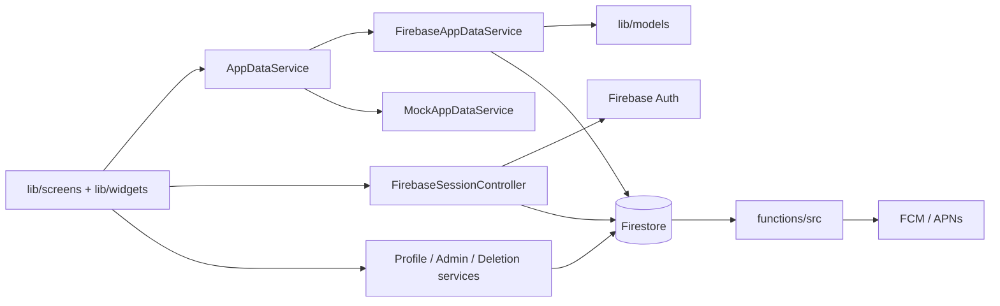

# Codebase Guide

This is the developer-facing companion to the repository [README](../README.md). The README explains the product, history, architecture, security model, and release state; this guide maps those concepts to the current source tree.

> **Phase note:** This guide currently establishes the implementation map and change boundaries needed to navigate the code safely. The detailed per-file atlas is expanded in the next recoverable documentation phase.

## Architecture map

## Current source areas

| Area | Responsibility |
| --- | --- |
| `lib/main*.dart`, `lib/app*.dart` | Fail-closed environment entrypoints, startup, route table, lifecycle |
| `lib/models/` | Accounts, profiles, classes, announcements, notifications, events, resources, locations, curriculum |
| `lib/services/firebase/` | Auth, Apple, session, route authorization, profile/family writes, live parsing, admin writes, location scope, deletion |
| `lib/services/firestore/` | Collection names and isolated audit/export/cleanup/migration/seed/schema-update implementations |
| `lib/services/` | Data contract/provider, mock data, recommendations, audiences, time zones, push registration/navigation, validation |
| `lib/screens/` | Member, onboarding/account, and administrator screens |
| `lib/widgets/`, `lib/theme/`, `lib/utils/` | Shared navigation, forms, guards, formatting, visual system |
| `functions/src/` | Targeted delivery synchronization and first-publication push dispatch |
| `firestore.rules`, `firestore.indexes.json` | Authorization boundary and query/index definitions |
| `android/`, `ios/` | Environment isolation, Firebase clients, native capabilities, release safeguards |
| `.github/workflows/` | Manual dev debug release and prod-flavor validation |
| `test/`, `tool/firebase_emulator_tests/`, `functions/test/` | Flutter, Rules emulator, and Functions coverage |

## Change boundaries

- A UI check is not authorization; pair Firestore changes with query, Rules, Functions, and emulator-test review.
- Parent access depends on exact ownership, not merely a linked ID.
- Targeted announcements remain delivery-based; member source queries are Everyone-only.
- Deletion order/mutation fields are coupled to Rules access-call limits.
- Dev/prod entrypoints, flavors/schemes, Firebase files, IDs, and CI remain consistent.
- Curriculum is bundled; sample test data must not become authenticated fallback.
- Production release signing remains external and fail closed.

## Development-only Firestore tools

Audit/export entrypoints are read-only. Cleanup, migration, schema update, and seed paths are write-capable and are not normal routes. Review source flags, target project, preconditions, and confirmations before use; repository presence is not authorization to modify data.

The comprehensive per-file entries, test map, Firebase/native atlas, and change-risk cross-references follow in the next phase.
