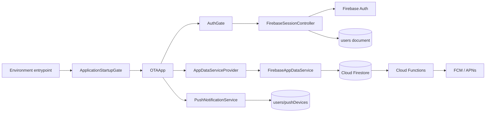
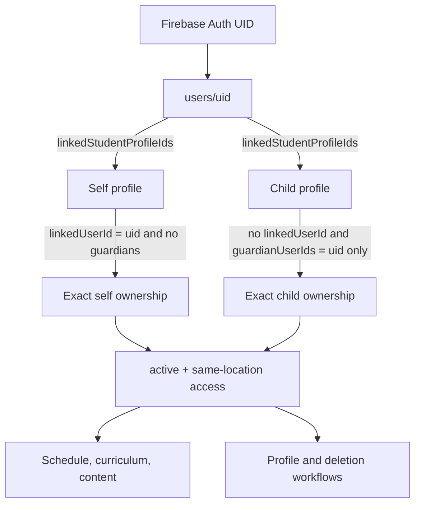
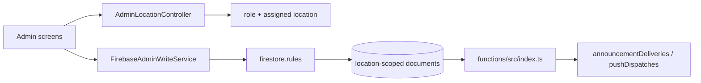
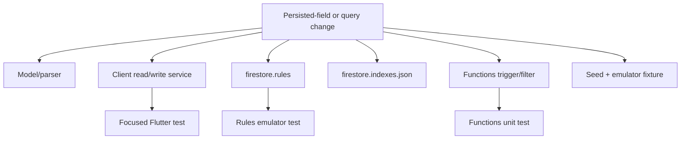
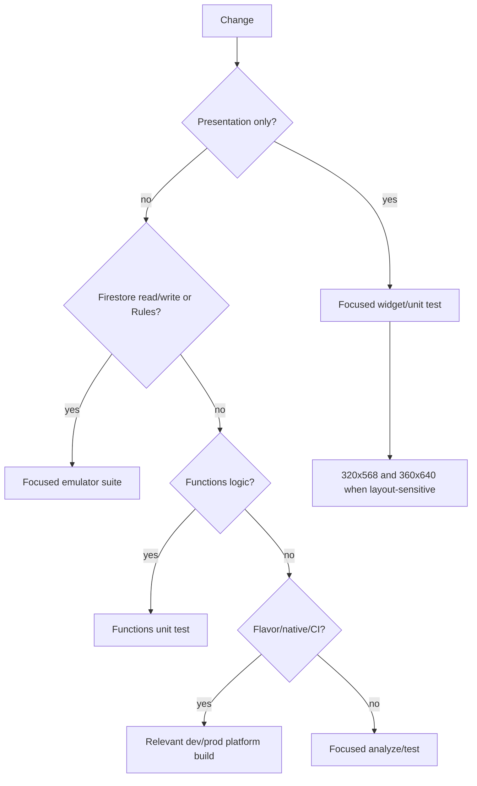

# Codebase Guide

The repository [README](../README.md) explains what the Olympic Taekwondo Academy application does, why it was built, and what remains before release. This guide answers a different question: **where is that behavior implemented?**

You can read this guide from the beginning to learn how the app fits together, or search for a file path when you need to make a change. It assumes basic programming knowledge, but it does not assume that you already know Flutter or Firebase.

## A few terms used throughout this guide

- A **screen** is a page the user sees, such as Schedule or Profile.
- A **widget** is a reusable piece of a Flutter screen, such as a button, card, or navigation bar.
- A **model** is a Dart object that represents application data. For example, a Firestore class document becomes a `ClassSession` model before the Schedule screen displays it.
- A **service** contains work that should not live inside a screen, such as signing in, loading Firestore data, or updating a student profile.
- A **provider** makes a shared object available to widgets below it in the Flutter widget tree. `AppDataServiceProvider`, for example, lets screens find the current data service.
- **Firebase Auth** is the login system. It verifies credentials and supplies a unique user ID (UID), but the separate Firestore account document supplies the person's OTA role, location, and profiles.
- **Cloud Firestore** is the hosted database. It organizes JSON-like documents into collections such as `users`, `studentProfiles`, and `classSessions`.
- A **Firestore listener** is a live subscription to a Firestore query or document. Firestore sends a new snapshot when matching data changes, so the app can update without a manual refresh.
- A **security rule** is server-enforced Firestore policy. It decides whether an attempted read or write is allowed. Hiding a button or redirecting a screen improves the user experience, but it does not replace a security rule.
- A **Cloud Function** is trusted backend code that runs in Firebase instead of on the phone. This project uses Functions to calculate notification recipients and send push messages.
- An **FCM token** identifies one app installation for Firebase Cloud Messaging. It is used to send push notifications to that device and is stored privately under the signed-in account.
- An **app flavor** is a named build variant. The `dev` and `prod` flavors use different Firebase projects and mobile identifiers so test data cannot be confused with production data.
- An Android **application ID** and an iOS **bundle ID** are the platform-specific identities of an installed app.
- **Reauthentication** means asking a signed-in user to prove their identity again before a sensitive action such as deleting the account.

## Contents

- [How a tap becomes data](#how-a-tap-becomes-data)
- [System relationships](#system-relationships)
- [Entrypoints and application shell](#entrypoints-and-application-shell)
- [Domain models](#domain-models)
- [Data contract and shared services](#data-contract-and-shared-services)
- [Firebase runtime services](#firebase-runtime-services)
- [Firestore maintenance services](#firestore-maintenance-services)
- [Bundled data](#bundled-data)
- [Member and account screens](#member-and-account-screens)
- [Administrator screens](#administrator-screens)
- [Shared presentation code](#shared-presentation-code)
- [Firestore and Firebase configuration](#firestore-and-firebase-configuration)
- [Cloud Functions](#cloud-functions)
- [Android integration](#android-integration)
- [iOS integration](#ios-integration)
- [Continuous integration](#continuous-integration)
- [Test map](#test-map)
- [Developer tools and historical artifacts](#developer-tools-and-historical-artifacts)
- [What to review when making common changes](#what-to-review-when-making-common-changes)

## How a tap becomes data

The easiest way to understand the repository is to follow two everyday actions through the code.

### Example 1: a student opens Schedule

1. The route opens `lib/screens/schedule_screen.dart`.
2. The screen asks `AppDataServiceProvider` for the app's current `AppDataService`.
3. In a normal signed-in session, the provider supplies `FirebaseAppDataService`. Tests can supply `MockAppDataService` instead.
4. `FirebaseAppDataService` maintains a live Firestore listener on the matching `classSessions` documents for the user's academy location.
5. `firestore.rules` checks the signed-in account, active state, role, and location before Firestore returns anything.
6. Each Firestore document is converted into a `ClassSession` Dart model.
7. `ClassRecommendationService` can compare those sessions with the selected student's age, belt, group, and preferred class.
8. The Schedule screen turns the resulting models into the day or week view the student sees.

The path is therefore:

```text
Schedule screen
  -> AppDataServiceProvider
  -> FirebaseAppDataService
  -> Firestore query + firestore.rules
  -> ClassSession models
  -> visible schedule
```

If schedule data is wrong, the cause might be the screen layout, the query, the model parser, a missing Firestore index, or Rules denying the query. The rest of this guide shows where each of those pieces lives.

### Example 2: an administrator publishes an announcement

1. `lib/screens/admin/admin_announcements_screen.dart` collects the message, location, importance, and audience.
2. It sends a typed `AnnouncementWriteData` value to `FirebaseAdminWriteService`.
3. The service validates and formats the fields, then writes the `announcements` document.
4. `firestore.rules` independently checks that the administrator may write for that location and that the document has an allowed shape. A **schema** is simply the expected set and type of fields in a stored document.
5. The write activates `pushPublishedAnnouncement` in `functions/src/index.ts`.
6. Backend logic in `functions/src/push_logic.ts` finds the accounts that match the audience.
7. For a targeted announcement, the Function creates a private `announcementDeliveries` document under each authorized account. It also finds registered devices and sends FCM push messages.
8. `FirebaseAppDataService` listens to the signed-in account's private deliveries, combines them with public Everyone announcements, and tells Notifications and Dashboard to update.

```text
Admin Announcements screen
  -> FirebaseAdminWriteService
  -> Firestore + firestore.rules
  -> Cloud Function
  -> recipient calculation
  -> private announcementDeliveries + FCM
  -> member Notifications and Dashboard
```

This longer path exists because a phone must not decide who is authorized to receive private content. The trusted backend makes that decision.

## System relationships

### Runtime data flow



`OTAApp` creates the shared objects that must stay alive while the app runs: the signed-in session, the live data service, push-notification handling, the selected student profile, and navigation state. Screens use those shared objects instead of creating new Firebase connections on every page. The `AppDataService` interface also lets tests replace Firebase with predictable in-memory data.

### Member and family ownership flow



The account stores profile IDs, and each profile also stores its relationship back to the account. Keeping the relationship in both places is a common Firestore technique called **denormalization**: it makes reads practical in a database without SQL joins. Because the same relationship appears twice, profile changes check both sides. A profile ID appearing in the account list is not enough by itself to prove ownership.

### Administrative write path



An Admin works only with the academy location assigned to that account. A Super Admin may choose among available locations. `FirebaseAdminWriteService` turns form values into the fields Firestore expects, while `firestore.rules` checks the request again on the server. The Rules enforce the role, location, fields that may not change, and allowed changes such as draft to published. This double check means a modified client cannot gain permission simply by bypassing the screen.

## Entrypoints and application shell

These files decide which Firebase environment starts and create the top-level Flutter application.

| File | What it does |
| --- | --- |
| `lib/main.dart` | Stops with an error instead of guessing an environment. A developer must explicitly run `main_dev.dart` or `main_prod.dart`, which prevents an accidental production connection. |
| `lib/main_dev.dart` | Starts the development flavor and passes the development Firebase settings into the shared startup code. |
| `lib/main_prod.dart` | Starts the production flavor and passes the production Firebase settings into the same startup code. |
| `lib/app_environment.dart` | Defines the two environments and the Firebase project ID expected for each one. Startup uses this information to catch a mismatched build. |
| `lib/firebase_options_dev.dart` | Holds the public Firebase client identifiers generated for the development project. If this file is regenerated, the Android and iOS Firebase files must still describe the same project. |
| `lib/firebase_options_prod.dart` | Holds the production Firebase client identifiers. Having these identifiers in Git configures the client; it does not prove that Rules or Functions have been deployed. |
| `lib/app_bootstrap.dart` | Performs startup in a controlled order: Flutter setup, time zones, Firebase initialization, project verification, and push setup. `ApplicationStartupGate` shows progress or a useful failure instead of opening a partly initialized app. |
| `lib/app.dart` | Defines `OTAApp`, the root widget. It creates the shared session, data, push, profile-selection, and navigation objects used by all screens, and cleans them up when appropriate. |
| `lib/routes.dart` | Keeps route names in one place so normal navigation and notification-tap navigation use the same destinations. |

The following binaries are isolated maintenance entrypoints, not normal application routes:

| File | What it launches |
| --- | --- |
| `lib/firestore_audit_main.dart` | Runs and displays the read-only Firestore audit; refuses release-mode use. |
| `lib/firestore_export_main.dart` | Produces a read-only structured database export for inspection; refuses release-mode use. |
| `lib/firestore_cleanup_main.dart` | Presents cleanup planning, warnings, explicit confirmation, execution, and post-run audit. It is write-capable and guarded. |
| `lib/firestore_schema_update_main.dart` | Runs only specifically allowed schema updates. Here, a schema means the fields and value types expected in Firestore documents. It is write-capable. |
| `lib/seed_firestore_main.dart` | Development seeding UI backed by `FirestoreSeedService`. Verify the Firebase target before running. |

## Domain models

Firestore returns maps of field names and values. Model files turn those maps into typed Dart objects that are easier and safer for the rest of the app to use. They also convert Dart objects back into Firestore fields when needed. If a stored field changes, check the model, queries, write service, Rules, indexes, Functions, seed data, and tests together.

| File | What it represents in the app |
| --- | --- |
| `lib/models/user_account.dart` | The person who signs in. `UserAccount` contains the role, academy location, linked student profiles, selected profile, and active/deletion state stored in `users/{uid}`. |
| `lib/models/student.dart` | A person who trains at the academy. `Student` contains identity, birth date, belt and sticker progress, preferred class, active state, and links to the account that owns it. |
| `lib/models/student_profile.dart` | Compatibility typedef exposing `StudentProfile` as `Student`. Keep imports stable unless completing a deliberate migration. |
| `lib/models/academy_location.dart` | One academy location, including its display details and time-zone name so schedules and events show local times correctly. |
| `lib/models/class_session.dart` | One scheduled or repeating class, including its location, time, active state, belt range, and eligible age/group information. |
| `lib/models/academy_announcement.dart` | An announcement's text, publication state, audience, importance, timestamps, and academy location. |
| `lib/models/notification_item.dart` | A common display shape for announcements, events, and resources so notification screens can show categories, priority, read state, and destinations consistently. |
| `lib/models/academy_event.dart` | A dated academy event, including local time, publication state, details, and an optional resource that contains its registration link. |
| `lib/models/academy_resource.dart` | A reusable academy article or link, including its content type, publication/archive state, and location. |
| `lib/models/curriculum_requirement.dart` | The sections and individual text/video items that make up the bundled requirements for a belt rank. |

## Data contract and shared services

### App data abstraction

#### `lib/services/app_data_service.dart`

**What this file is**

`AppDataService` is an interface: it lists the data operations that screens may ask for without saying whether the answer comes from Firebase or from test data.

**What it does**

It gives screens access to the current account and profiles, academy locations, schedule, announcements, notifications, events, resources, loading/error state, and the selected profile. Because it is `Listenable`, it can tell Flutter to rebuild a screen when any of that data changes.

**Where you see its effects in the app**

Almost every signed-in screen uses this interface, including Dashboard, Schedule, Notifications, Events, Resources, Profile, and the administrator screens.

**How it connects to the rest of the app**

Screens ask for `AppDataService`; `AppDataServiceProvider` supplies either `FirebaseAppDataService` for the real app or `MockAppDataService` for controlled tests and previews.

**When you would change this file**

Change it when a screen needs a new shared kind of readable data or loading/error operation. Update both implementations and their tests at the same time. Privileged writes belong in a dedicated write service rather than being hidden here.

When adding a read surface, update the contract, `FirebaseAppDataService`, `MockAppDataService`, provider wiring, and affected tests together. Do not hide a privileged write inside this contract merely for UI convenience.

#### `lib/services/app_data_service_provider.dart`

Places the current `AppDataService` above the screens in Flutter's widget tree. A screen can then ask for the service without receiving it through every constructor. If a test reports that no provider exists, its widget was probably built outside the normal app shell.

#### `lib/services/mock_app_data_service.dart`

Keeps predictable sample records in memory for isolated screen development and tests. It uses files in `lib/data/`. The signed-in production app must never show this data as a fallback when Firebase fails, because users could mistake samples for real academy information.

### Shared business and runtime helpers

| File | What it does and where it matters |
| --- | --- |
| `lib/services/announcement_audience.dart` | Gives announcement audience values one shared meaning in Flutter. It labels and interprets Everyone, belt, recurring class group, and specific-student audiences, while reading only the legacy values the app still supports. Admin authoring, member reads, Rules, Functions, and tests must agree with it. |
| `lib/services/class_recommendation_service.dart` | Finds the next suitable active class for the selected student by comparing location, age/group, belt, time, and preference. Dashboard and Schedule use the result. |
| `lib/services/event_resource_rules.dart` | Checks that a current event links to no registration resource or exactly one valid resource. It also helps the app read older events that had several links without writing that older shape again. |
| `lib/services/location_time_service.dart` | Converts stored times into the academy location's local clock and formats them for forms and screens. Schedule and Events depend on it, as do the administrator date/time editors. |
| `lib/services/debug_view_controller.dart` | Lets a developer preview student or administrator UI in debug builds. It changes presentation only and never grants data access. |
| `lib/services/push_runtime.dart` | Defines small interfaces around token lookup, device registration, and installation IDs. Tests replace these interfaces with fakes instead of contacting Firebase Messaging. |
| `lib/services/push_navigation_coordinator.dart` | Saves the destination from a notification tap until the app, session, and navigator are ready, then opens the matching announcement, event, or resource safely. |

#### `lib/services/push_notification_service.dart`

**What this file is**

This is the phone-side push-notification coordinator. It connects Firebase Cloud Messaging to the signed-in OTA account.

**What it does**

- asks the operating system for notification permission;
- gets and refreshes the FCM token for this installation;
- creates a stable random installation ID;
- stores a private device record at `users/{uid}/pushDevices/{installationId}`;
- handles notifications received while the app is open;
- converts notification data into an app destination; and
- exposes sanitized debug diagnostics and a retry path without displaying tokens.

**Where you see its effects in the app**

It affects permission prompts, foreground notification banners, notification taps, and the debug-only Push Diagnostics section on Profile. Failure to register push does not block normal app navigation or in-app announcements.

**How it connects to the rest of the app**

`OTAApp` starts it when the session is suitable. The service uses the interfaces in `push_runtime.dart`, writes through `FirestoreDeviceRegistrationStore`, and hands tap destinations to `PushNavigationCoordinator`.

**Important things to understand**

A token identifies an installation, not a person. Registration is best effort because permission can be denied and tokens can temporarily be unavailable. Firestore Rules make each device document private to its account, and backend code removes tokens that FCM reports as permanently invalid.

**Related files and tests**

Review `lib/app.dart`, `lib/services/push_runtime.dart`, `lib/services/push_navigation_coordinator.dart`, `lib/screens/profile_screen.dart`, `functions/src/push_logic.ts`, `test/foreground_push_notification_test.dart`, and `test/release_push_regression_test.dart` together.

**When you would change this file**

Change it when device registration, permission handling, foreground display, token refresh, diagnostics, or push destination parsing changes.

## Firebase runtime services

### Session and routing

#### `lib/services/firebase/firebase_session_controller.dart`

**What this file is**

This is the app's understanding of who is signed in and what that person is ready to do. Firebase Auth proves the login identity; the Firestore user document supplies the OTA role, location, active state, and profile links.

**What it does**

- watches Firebase Auth for sign-in and sign-out;
- listens to `users/{uid}` for the OTA account;
- loads and checks linked student profiles;
- chooses a `SessionStage`, such as signed out, creating a profile, ready as a member, ready as an administrator, unavailable, or error;
- refreshes and signs out cleanly; and
- tells `AuthGate` and `OTAApp` whenever the stage changes.

**Where you see its effects in the app**

It decides whether the user sees Welcome/Login, profile creation, the member experience, the administrator experience, or an error/unavailable page.

**How it connects to the rest of the app**

Firebase Auth and `FirebaseAuthenticationService` provide the login. Firestore provides the account and profiles. `LinkedProfileReconciler` checks missing profile links. `AuthGate` turns the resulting session stage into navigation.

**Important things to understand**

Auth and the OTA account are separate. A valid Firebase login with no user document is an onboarding state, not a complete OTA account. The controller also guards against late results: data requested for the previous user must not appear after a quick sign-out and sign-in.

**Related files and tests**

Read `lib/screens/auth/auth_gate.dart`, `lib/services/firebase/firebase_authentication_service.dart`, `lib/services/firebase/profile_service.dart`, `lib/services/firebase/linked_profile_reconciler.dart`, `test/auth_navigation_test.dart`, `test/signup_session_transition_test.dart`, and `test/firebase_session_reconciliation_test.dart` with this file.

**When you would change this file**

Change it when adding a session stage, changing account-readiness rules, altering sign-out behavior, or changing how account/profile listeners are replaced.

#### `lib/services/firebase/route_authorization.dart`

Decides which groups of screens a signed-in Student, Parent, Admin, or Super Admin may navigate to. This keeps the UI flow sensible. Firestore Rules separately protect the underlying data, even if someone bypasses Flutter navigation.

#### `lib/services/firebase/admin_location_controller.dart`

Keeps track of the academy location currently shown in administrator screens. A normal Admin is fixed to the assigned location; a Super Admin can select another available location. Admin data queries and writes use this choice. Debug-only overrides help local UI testing but do not grant Firestore permission.

### Authentication and identity

| File | Responsibility |
| --- | --- |
| `lib/services/firebase/firebase_authentication_service.dart` | Provides the login methods used by the UI: email/password and Google. It translates Firebase error codes into a smaller set of app errors so screens can show stable, useful messages. |
| `lib/services/firebase/firebase_identity_contract.dart` | Chooses reliable name, email, and photo values from a provider identity. It avoids replacing a saved profile value with an empty or less trustworthy value during account creation or later reconciliation. |
| `lib/services/firebase/apple_authentication.dart` | Runs the native Sign in with Apple request safely, including nonce protection, cancellation, and Apple's one-time name/email behavior. It also obtains the authorization code needed to revoke Apple access before account deletion. |
| `lib/services/firebase/linked_profile_reconciler.dart` | Compares the profile IDs listed on the account with the profile documents actually loaded. It preserves order, can request missing documents, and reports missing or invalid links rather than creating imaginary profiles. |

### Live reads

#### `lib/services/firebase/firebase_app_data_service.dart`

**What this file is**

This is the main bridge between Firestore and the Flutter screens that display live academy information.

**What it does**

- listens for changes to the signed-in account and its student profiles;
- loads locations and the matching schedule;
- loads announcements, events, and resources;
- watches private notification read state and targeted deliveries;
- changes its queries when the role, academy location, or selected profile changes;
- converts Firestore documents into the model classes in `lib/models/`; and
- tells listening screens when data, loading state, or errors change.

**Where you see its effects in the app**

Student Dashboard, Schedule, Notifications, Events, Resources, Profile, profile management, and every administrator content screen depend on this service.

**How it connects to the rest of the app**

`OTAApp` creates the service and exposes it through `AppDataServiceProvider`. Screens use the `AppDataService` interface. This implementation creates Firestore queries and model objects behind that interface.

**Important things to understand**

- Members read only published `everyone` announcement source documents plus the targeted copies in their own `users/{uid}/announcementDeliveries` subcollection. The service combines both sources and removes duplicates.
- Notification read state comes from `users/{uid}/notificationReads`; push device registration is handled separately.
- Schedule, events, and resources are location-scoped and filtered to states a member may see. Admin reads include authorized management states.
- A Super Admin must still choose which authorized location to view before location-specific content is loaded.
- Listener replacement must clear stale data and suppress late callbacks from a previous account/location/profile.

The first point is especially important: targeted announcement text is not downloaded from the shared `announcements` collection and hidden afterward. The trusted Cloud Function writes an authorized copy into the account's private `announcementDeliveries` subcollection, and this service reads that copy.

**Related files**

Most model files, `lib/services/announcement_audience.dart`, `lib/services/location_time_service.dart`, `lib/services/firebase/notification_read_exception.dart`, `firestore.rules`, and `firestore.indexes.json` are commonly reviewed with this service.

**Tests**

Relevant coverage includes `test/firebase_announcement_delivery_test.dart`, `test/access_routing_multilocation_test.dart`, `test/focused_profile_notification_test.dart`, `test/notification_read_exception_test.dart`, and `test/release_push_regression_test.dart`.

**When you would change this file**

Change it when a live screen needs a new query, a stored field is parsed differently, notification sources change, or listener lifecycle behavior changes. Query changes may also require a Firestore index and Rules emulator test.

### Member profile and family writes

#### `lib/services/firebase/profile_service.dart`

**What this file is**

`FirestoreProfileService` is the write service for creating and editing member accounts and family student profiles. It keeps these rules out of large form widgets.

**What it does**

- creates the first `users/{uid}` account and its student profiles after signup;
- edits account contact information;
- edits a student profile;
- lets a parent add a child or add the parent's own training profile; and
- validates and saves a preferred class.

**Where you see its effects in the app**

Profile Creation, Manage Profiles, the profile edit pages, Add Child, Add Parent Student Profile, and preferred-class selection all use this service.

**How it connects to the rest of the app**

Form widgets create typed input objects. The service validates them, then uses Firestore batches or transactions to update the account and profiles together. A **transaction** reads current documents and writes only if those documents have not changed underneath it, which is important when checking a class or relationship before saving.

**Important things to understand**

The service enforces these current family rules:

- public account roles are parent or student; administrative roles are not self-assigned;
- the account holder is at least 16;
- a self profile has `linkedUserId == uid` and no guardians;
- a child has no `linkedUserId` and exactly one guardian matching the parent UID;
- profiles are active, same-location, and linked in both directions;
- a parent can add at most ten child profiles (eleven total profiles when the parent also trains);
- preferred class is absent or one syntactically valid ID, then transactionally verified as active, same-location, and group-compatible;
- new writes use the current standard class-group IDs; an older ambiguous teen/adult value is not guessed into a current group.

The matching relationship is stored on both account and profile documents. The service checks both sides because one stray list ID must not give access to a profile. It reports expected problems through `ProfileServiceException`, allowing forms to show a useful message.

**Related files and tests**

Review `lib/models/user_account.dart`, `lib/models/student.dart`, `lib/widgets/profile/profile_edit_sheets.dart`, `lib/screens/auth/profile_creation_screen.dart`, `lib/services/class_recommendation_service.dart`, `firestore.rules`, `test/profile_service_test.dart`, `test/profile_creation_screen_test.dart`, and `test/profile_management_regression_test.dart`.

**When you would change this file**

Change it when onboarding fields, family limits, profile ownership, account contact fields, or preferred-class rules change.

### Administrative writes

#### `lib/services/firebase/firebase_admin_write_service.dart`

**What this file is**

This is the common write service behind the administrator forms. Screens describe the intended change using typed data objects; this service turns that request into Firestore fields.

**What it does**

- updates a student's belt and sticker progress;
- creates, edits, publishes, archives, or deletes supported announcement states;
- saves events and their optional registration resource;
- saves General Resources; and
- creates, edits, or deletes individual class sessions.

**Where you see its effects in the app**

Admin Students, Schedule, Announcements, Events, and Resources all call this service.

**How it connects to the rest of the app**

An admin screen builds a type such as `AnnouncementWriteData` or `AdminStudentProgressWriteData`. The service checks the selected admin location, formats the document, and sends it to Firestore. Rules then make the final server-side allow/deny decision.

**Important things to understand**

- student progress writes keep `belt`, sticker progress (`current`, `required`, `nextRank`), and the current curriculum rank names consistent;
- announcement audience/status changes drive delivery synchronization and push triggers;
- event registration resource validation uses the zero-or-one current model;
- schedule edits use the current class-group values and stay at the selected location; bulk schedule actions are preview-only in the current UI;
- archive transitions are intentionally narrow, especially for legacy resources/events.

The individual schedule editor writes real changes; bulk schedule actions currently show an impact preview only. Client validation creates clearer errors, but a mock success is not proof of permission—the Rules emulator tests the actual data boundary.

**Related files and tests**

Review the relevant admin screen, matching model, `event_resource_rules.dart`, `announcement_audience.dart`, `firestore.rules`, and the focused Flutter and emulator tests. Student progress is covered by `test/admin_student_progress_test.dart` and `tool/firebase_emulator_tests/admin_student_progress.test.js`.

**When you would change this file**

Change it when an administrator form gains a saved field or when the allowed document shape or lifecycle changes.

### Account deletion

#### `lib/services/firebase/account_deletion_service.dart`

**What this file is**

This service performs permanent member account deletion. The work is separated from the screen because deletion crosses Firebase Auth, several Firestore documents, provider-specific identity checks, and recovery behavior.

**What it does**

- reauthenticates a password, Google, or Apple user;
- revokes Apple authorization before deleting anything;
- removes private notification-read, push-device, and announcement-delivery documents;
- removes or detaches every exactly owned student profile;
- deletes the Firestore account document; and
- deletes the Firebase Auth identity last.

**Where you see its effects in the app**

`AccountDeletionScreen` explains the consequences, collects fresh identity proof, runs this service, and reports success or a retryable failure. Admin and Super Admin accounts are refused because their deletion requires an operational process.

**How it connects to the rest of the app**

The screen calls `AccountDeletionService`. Provider adapters obtain fresh proof; `FirestoreAccountDeletionStore` performs database steps; Firebase Auth removes the login identity at the end.

**Important things to understand**

Deletion is resumable:

1. Reauthenticate and, for Apple, revoke the authorization code.
2. Delete private user subcollections in small batches so one request does not become too large.
3. Mark `accountDeletionInProgress` on the user document.
4. Update each profile whose account/profile fields prove ownership in its own transaction, recording `profileMutationId` so a retry can recognize completed work.
5. Delete the user document, then delete the Auth user.
6. If Firestore deletion already completed, a retry may finish Auth-only cleanup; partial profile work can resume safely.

The work is split into small steps because Firestore Rules limit how many other documents one request may read. The `profileMutationId` marker makes retries recognizable, and the `accountDeletionInProgress` state prevents ordinary account use while cleanup is underway. If the Firestore work succeeded but Auth deletion failed, a later retry can finish the remaining Auth-only step.

**Related files and tests**

Review `lib/screens/account_deletion_screen.dart`, ownership helpers in `firestore.rules`, `test/account_deletion_service_test.dart`, `test/account_deletion_screen_test.dart`, and `tool/firebase_emulator_tests/account_deletion.test.js`.

**When you would change this file**

Change it when adding an identity provider, adding private account data, changing family ownership, or changing deletion recovery. Order matters: Apple revocation and fresh proof must happen before destructive Firestore work, while Auth deletion stays last.

### Error adapter

`lib/services/firebase/notification_read_exception.dart` converts low-level Firebase failures from marking notifications read/unread into a few understandable app errors. Screens can then show consistent messages without knowing Firebase error-code details.

## Firestore maintenance services

These services support one-time database inspection or repair and are not reachable from the normal member/admin navigation. Read-only tools cannot change Firestore, but their output can still contain private data. Write-capable tools require a verified Firebase project, a reviewed plan, and an authorized operator; finding a command in this guide is not permission to run it.

| File | What it does |
| --- | --- |
| `lib/services/firestore/firestore_collections.dart` | Keeps the seven application collection names in one place for maintenance tools. Renaming one is a database migration, not a simple constant edit. |
| `lib/services/firestore/firestore_audit_service.dart` | Reads documents, checks expected fields and relationships, and returns informational, warning, or error findings without writing anything. The checked-in JSON is one historical run, not current database status. |
| `lib/services/firestore/firestore_export_service.dart` | Reads collections into structured JSON for inspection. It is useful evidence, but it is not a Firebase-managed backup or restore mechanism. |
| `lib/services/firestore/firestore_cleanup_service.dart` | Builds a visible cleanup plan, highlights ambiguous guardian relationships, updates or removes selected fields after confirmation, stops on failure, and audits again. It never silently deletes whole documents. |
| `lib/services/firestore/firestore_migration_service.dart` | Converts known older user, guardian, class-group, resource, and location fields into the current form. Its result objects report successes and partial failures so an operator can see exactly what happened. |
| `lib/services/firestore/firestore_schema_update_service.dart` | Runs only named `ApprovedSchemaUpdateOperation` values that were added in code. The maintenance screen cannot invent an arbitrary database rewrite. |
| `lib/services/firestore/firestore_seed_service.dart` | Writes deterministic development data for supported collections. Never aim it at production simply because the build can reach that project. |

## Bundled data

| File | What the app uses it for |
| --- | --- |
| `lib/data/sample_curriculum.dart` | The bundled production curriculum and local admin-form representation. Despite the historical `sample_` name, it is the current curriculum source. Its standard belt order runs from No Belt through Black, and each `nextRank` must agree with administrator progress writes. |
| `lib/data/sample_constants.dart` | Names and values shared by the other predictable sample records. |
| `lib/data/sample_schedule.dart` | Fake class sessions used when testing or previewing schedule UI without Firestore. |
| `lib/data/sample_events.dart` | Fake events used by the mock data service and tests. |
| `lib/data/sample_notifications.dart` | Fake notification items used by the mock data service and tests. |
| `lib/data/sample_resources.dart` | Fake resources used by the mock data service and tests. |
| `lib/data/sample_student.dart` | Fake account and student profiles used by the mock data service and tests. |

Curriculum is the only production content intentionally loaded from these files. Other `sample_*` data supports mocks, previews, or tests and must not become fallback data for an authenticated user after a live read failure.

## Member and account screens

### Authentication and onboarding

These screens are public or appear before a complete OTA account is ready.

| File | What the user sees and what the screen calls |
| --- | --- |
| `lib/screens/welcome_screen.dart` | Introduces the application and sends a visitor to Login or Sign Up. It does not read private academy data. |
| `lib/screens/login_screen.dart` | Offers email/password, Google, and Apple sign-in and password reset. It calls the authentication services and turns their stable error values into messages. |
| `lib/screens/signup_screen.dart` | Creates a Firebase Auth login, then lets the session move to profile creation. Public signup can create Parent or Student accounts, never Admin or Super Admin. |
| `lib/screens/auth/auth_gate.dart` | Watches `FirebaseSessionController` and chooses the correct next UI: public auth, profile creation, member app, admin app, loading, unavailable, or error. |
| `lib/screens/auth/profile_creation_screen.dart` | Collects academy location, Parent/Student role, account-holder profile, and optional children. It builds a `ProfileCreationRequest` for `FirestoreProfileService`. |
| `lib/screens/auth/account_ready_screen.dart` | Confirms that account/profile creation finished and moves into the signed-in application. |
| `lib/screens/content_unavailable_screen.dart` | Explains safely when content referenced by a route or notification no longer exists or is no longer allowed for this session. |

### Member experience

These screens are used by Parent and Student accounts. Parents may switch between the student profiles they own.

| File | What the user sees and what the screen calls |
| --- | --- |
| `lib/screens/student_dashboard_screen.dart` | Shows the selected student's next suitable class, belt/sticker progress, recent notifications, and links to common areas. It reads `AppDataService` and class recommendations. |
| `lib/screens/schedule_screen.dart` | Shows day/week classes in academy-local time, marks eligibility, recommends the next class, and lets an owned profile choose one preferred class through the profile service. |
| `lib/screens/curriculum_screen.dart` | Bundled belt curriculum sections/items with text and embedded YouTube presentation. |
| `lib/screens/notifications_screen.dart` | Shows the merged feed of public announcements, private targeted deliveries, events, and resources. Users can filter unread/important items and change read state. |
| `lib/screens/notification_detail_screen.dart` | Opens one notification destination, marks it read when appropriate, and shows a safe unavailable state if access or content disappeared. |
| `lib/screens/events_screen.dart` | Shows published events in a month calendar, converts times to the academy location, opens details, and links to the event's optional registration resource. |
| `lib/screens/resources_screen.dart` | Opens the resource-category landing page or the General Resources list, depending on the selected route. |
| `lib/screens/resource_detail_screen.dart` | Shows one published resource and launches its external HTTP/HTTPS link after validation. |
| `lib/screens/profile_screen.dart` | Summarizes account, selected student, belt, family, academy, and settings. It links to profile management and deletion and shows push diagnostics only in debug builds. |
| `lib/screens/manage_profiles_screen.dart` | Lets a Parent edit contact information and manage the parent's own training profile or exclusively owned children through `FirestoreProfileService`. |
| `lib/screens/account_deletion_screen.dart` | Explains permanent deletion, asks for provider-specific reauthentication, blocks privileged accounts, calls `AccountDeletionService`, and supports retryable outcomes. |

Profile-dependent routes must handle a removed, inactive, missing, or unauthorized selected profile without leaking another profile's cached data.

## Administrator screens

These screens are available only in the administrator UI. `AdminLocationController` supplies the current permitted location, `FirebaseAppDataService` supplies live lists, and `FirebaseAdminWriteService` handles saved changes.

| File | What the administrator can do |
| --- | --- |
| `lib/screens/admin/admin_dashboard_screen.dart` | See a summary for the current location and open Students, Schedule, Announcements, Events, Resources, or Profile. |
| `lib/screens/admin/admin_students_screen.dart` | Search and filter students, inspect account relationships, and update belt and sticker progress. The screen builds `AdminStudentProgressWriteData`. |
| `lib/screens/admin/admin_schedule_screen.dart` | List and edit individual classes, times, status, belt range, and age/group eligibility. Bulk actions calculate and display impact but do not currently write changes. |
| `lib/screens/admin/admin_announcements_screen.dart` | Create drafts, publish, edit, or archive announcements and choose Everyone, belt, recurring class group, or specific students. Publication starts backend delivery/push work. |
| `lib/screens/admin/admin_events_screen.dart` | Manage draft, published, and past events in location-local time and optionally select one published registration resource. |
| `lib/screens/admin/admin_resources_screen.dart` | Create, publish, edit, archive, and filter General Resources and reuse the admin version of the General Resources view. |
| `lib/screens/admin/admin_profile_screen.dart` | Show administrator identity, role, and effective academy location, with access to relevant profile/settings actions. |

All admin screens depend on `AdminLocationController`, live data, and `FirebaseAdminWriteService`. Visibility is not permission: Rules enforce the same location and role constraints at the database boundary.

## Shared presentation code

### Navigation, scaffolding, and forms

| File | What it supplies to screens |
| --- | --- |
| `lib/widgets/admin/admin_bottom_nav_bar.dart` | The shared administrator page frame: responsive navigation, header, destinations, transitions, and page-title behavior. |
| `lib/widgets/admin/admin_location_selector.dart` | The location picker shown when the current administrator is allowed to choose a location. It reads `AdminLocationController`. |
| `lib/widgets/ota_bottom_nav_bar.dart` | Member bottom-navigation destinations and rendering. |
| `lib/widgets/ota_branded_scaffold.dart` | The common page background and responsive layout used by branded public/auth screens. |
| `lib/widgets/ota_logo_mark.dart` | Reusable OTA logo mark drawn by Flutter presentation code. |
| `lib/widgets/ota_action_button.dart` | Primary/secondary action button with consistent disabled/loading presentation. |
| `lib/widgets/ota_auth_text_field.dart` | A consistently styled and validated text field for login and signup forms. |
| `lib/widgets/ota_auth_switch_link.dart` | The prompt that switches between Login and Sign Up. |
| `lib/widgets/unsaved_changes_guard.dart` | Detects an edited form and asks before back navigation discards the changes. |
| `lib/widgets/location_date_time_field.dart` | Displays and edits a date/time using the selected academy location rather than the phone's unrelated local zone. |
| `lib/widgets/schedule_time_field.dart` | Presents the time picker and formatting used in schedule forms. |

### Feature widgets and visual system

| File | What it supplies to screens |
| --- | --- |
| `lib/widgets/notifications/notification_card.dart` | Notification row/card, category and importance presentation. |
| `lib/widgets/profile/profile_section.dart` | Reusable profile section, information row, and action row. |
| `lib/widgets/profile/profile_edit_sheets.dart` | The account-contact, student, Add Child, parent-self, and preferred-class edit pages. They build typed inputs for `FirestoreProfileService`. |
| `lib/widgets/resources/resources_landing_view.dart` | Member/admin resource-category landing cards. |
| `lib/widgets/resources/general_resources_view.dart` | Published general-resource list/cards. |
| `lib/theme/ota_colors.dart` | Named colors shared across the app so visual meaning and contrast stay consistent. |
| `lib/utils/notification_formatters.dart` | Shared dates, labels, and display formatting for notification content. |

Responsive regressions are most likely in dense headers, row actions, edit sheets, schedule timelines, and admin tables. The focused layout test exercises 320x568 and 360x640 viewports with increased text scale.

## Firestore and Firebase configuration

### Database contract

#### `firestore.rules`

**What this file is**

This is the server-side access policy for every Firestore request made by the mobile app. Firebase evaluates these rules even if someone modifies the Flutter client or calls Firestore directly.

**What it does**

- checks that a Firebase Auth UID has the expected active `users/{uid}` account;
- applies Student, Parent, Admin, and Super Admin permissions;
- confines members and normal administrators to their academy location;
- verifies exact parent/self profile relationships;
- controls which document fields a client may create or change;
- protects private notification reads, devices, and targeted deliveries;
- allows only supported publish/archive transitions; and
- supports the small, retryable account-deletion steps without granting general destructive access.

**Where you see its effects in the app**

Every Firestore-backed screen depends on Rules. A denied read appears as unavailable/error data; a denied write appears as a save error. The Rules do not decide which screen is visible—that is `route_authorization.dart`—but they remain the real data protection.

**Important things to understand**

Firestore Rules are not filters. A query must be written so all possible returned documents are allowed. The app cannot request every announcement and rely on Flutter to hide private ones. Rules also limit how many other documents one request may inspect, which is why large-family account deletion uses one profile transaction at a time.

**Related files and tests**

Queries in `FirebaseAppDataService`, writes in `FirestoreProfileService` and `FirebaseAdminWriteService`, Functions delivery documents, `firestore.indexes.json`, and all suites under `tool/firebase_emulator_tests/` must stay consistent with the Rules.

**When you would change this file**

Change it when a stored field, query, role, ownership rule, private subcollection, or allowed write changes. Add or update an emulator test for both the allowed case and a meaningful denied case.

### Other Firebase configuration

| File | What it controls |
| --- | --- |
| `firestore.indexes.json` | Lists multi-field indexes required by queries that filter and sort on several fields. Firestore may reject a new query until its matching index is deployed. |
| `firebase.json` | Tells the Firebase CLI where Rules, indexes, and Functions live and how the local emulators are configured. |
| `.firebaserc` | Gives convenient names to the development and production Firebase projects. An operator must still verify the actual project ID before any deployment or data operation. |

Major collections are `locations`, `users`, `studentProfiles`, `classSessions`, `announcements`, `events`, `resources`, and `pushDispatches`. Private user subcollections are `notificationReads`, `pushDevices`, and `announcementDeliveries`.

### What to review when stored data changes



Rules may call `get()` or `exists()` to inspect related documents, but Firestore permits only a limited number of those calls for one request. Account deletion is split into one profile update at a time for this reason. If a rule starts reading another related document, test the largest supported family/workflow in the emulator rather than assuming the call budget still fits.

## Cloud Functions

The TypeScript package under `functions/` is backend code that runs in Firebase, not on the phone. It targets Node.js 22. `functions/package.json` lists direct dependencies and commands, `functions/package-lock.json` records the exact installed dependency tree, and `functions/tsconfig.json` controls TypeScript compilation.

### `functions/src/index.ts`

**What this file is**

This is the deployed entrypoint for OTA's publication triggers. A trigger is a function Firebase starts automatically after a matching Firestore document changes.

**What it does**

It exports three Firestore v2 document-written triggers:

- `pushPublishedAnnouncement`
- `pushPublishedEvent`
- `pushPublishedResource`

Each trigger compares the document before and after the write. The first meaningful publication can send push; later edits do not automatically resend the same publication. Announcement writes also add, update, or remove private delivery copies as the audience changes. Configuration keeps the Functions in `us-east1`, enables retry, and limits simultaneous instances to control load/cost.

**Where you see its effects in the app**

Members receive targeted announcements in Notifications and may receive push for newly published announcements, events, and General Resources.

**How it connects to the rest of the app**

Admin writes change Firestore documents. Firebase invokes this file, which calls helpers in `push_logic.ts`, uses the Admin SDK to read accounts/devices and write deliveries/dispatch status, then calls FCM.

**Important things to understand**

The code existing in Git does not mean the Functions are deployed. Deployment needs the intended Firebase project, region, billing authorization, coordinated Rules/indexes, and operational validation.

**When you would change this file**

Change it when adding a publication trigger, altering deployment options, or changing how a document write enters the shared delivery pipeline.

### `functions/src/push_logic.ts`

**What this file is**

This file holds the reusable decision-making for recipient delivery and push. Keeping those decisions separate from the Firebase trigger makes them easier to test without deploying anything.

**What it does**

- decides whether a write is the first publication;
- interprets current and intentionally supported older audience values;
- matches an announcement against all active profiles truly owned by an account;
- collects and deduplicates device tokens for eligible accounts;
- builds safe notification data and FCM payloads;
- claims and completes a dispatch record so retries do not freely duplicate sends;
- splits multicast sends into batches of at most 500; and
- classifies permanent token failures so dead device records can be removed.

`pushDispatches` records whether backend work is available, processing, complete, or failed. A five-minute lease lets a retry recover abandoned work while preventing two active workers from sending the same publication together. This is **idempotency**: retrying should not create a different user-visible result. Push remains best effort; the durable in-app announcement/event/resource is still the source of truth.

**Related files and tests**

Review `functions/src/index.ts`, `functions/test/push_logic.test.ts`, `lib/services/announcement_audience.dart`, `lib/services/push_notification_service.dart`, and the push/delivery sections of `firestore.rules` together.

**When you would change this file**

Change it when audience matching, ownership, device selection, payload format, dispatch retry, token cleanup, or FCM batching changes.

### `functions/test/push_logic.test.ts`

Runs Node tests for publication, audience matching, dispatch claims, payload construction, batching, and token classification without contacting Firebase. Rules emulator tests separately prove which clients may read or write device, delivery, and dispatch documents.

## Android integration

Android flavors let a developer install a development build and a production build with different Firebase projects and application IDs. These are the customized files that make that separation and release signing work.

| File or group | What it controls |
| --- | --- |
| `android/app/build.gradle.kts` | Defines dev/prod flavors, their application IDs and Flutter entrypoints, Google Services setup, debug/release builds, and production signing. A production release reads external `key.properties` values and stops if they are incomplete; it never uses the debug certificate as a fallback. |
| `android/build.gradle.kts`, `android/settings.gradle.kts`, `android/gradle.properties` | Root plugin repositories/versions, modules, and Gradle properties. Keep compatible with Flutter's supported Android toolchain. |
| `android/gradle/wrapper/gradle-wrapper.properties`, `android/gradle/wrapper/gradle-wrapper.jar`, `android/gradlew`, `android/gradlew.bat` | Pin Gradle 9.1 so a clean checkout uses the intended build tool. Update the properties, JAR, and scripts together and review their source. |
| `android/key.properties.example` | Template for external signing paths/aliases. Real keys and secrets do not belong in Git. |
| `android/app/src/dev/google-services.json` | Development Firebase Android client for `com.otamanagement.app`. |
| `android/app/src/prod/google-services.json` | Production Firebase Android client for `com.otacheshire.app`. |
| `android/app/src/main/AndroidManifest.xml` | Shared app manifest, notification metadata/capabilities, and Flutter activity configuration. |
| `android/app/src/debug/AndroidManifest.xml`, `android/app/src/profile/AndroidManifest.xml` | Non-release network/debug/profile overrides. Do not infer production capability from these manifests. |
| `android/app/src/main/kotlin/com/otamanagement/app/MainActivity.kt` | Flutter Android host activity. Its package aligns with the source namespace while flavor application IDs distinguish installed apps. |
| `android/app/src/main/res/drawable/ic_stat_ota.xml` | Monochrome notification status icon used by Android push presentation. |
| `android/app/src/main/res/drawable/launch_background.xml`, `android/app/src/main/res/drawable-v21/launch_background.xml`, `android/app/src/main/res/values/styles.xml`, `android/app/src/main/res/values-night/styles.xml` | Launch theme/background behavior across Android versions and light/dark modes. |
| `android/app/src/main/res/mipmap-*/ic_launcher.png` | Density-specific launcher icons; replace as a complete generated asset set. |

Gradle pins `lib/main_dev.dart` or `lib/main_prod.dart` to the chosen flavor. Even if someone supplies a conflicting Flutter target, the Android task refuses to silently connect the wrong app to the wrong Firebase project. A `prod` debug build checks production configuration without signing secrets; a distributable release additionally requires the production keystore.

## iOS integration

iOS uses Xcode schemes and build configurations for the same dev/prod separation. The bundle ID tells iOS, Apple services, and Firebase which app is being built.

| File or group | What it controls |
| --- | --- |
| `ios/Runner.xcodeproj/project.pbxproj` | The main Xcode project settings: build configurations, bundle IDs, Flutter targets, Apple capabilities, Firebase copy step, and files included in the app. It is large and generated partly by Xcode, so review focused changes carefully. |
| `ios/Runner.xcodeproj/xcshareddata/xcschemes/dev.xcscheme`, `ios/Runner.xcodeproj/xcshareddata/xcschemes/prod.xcscheme`, `ios/Runner.xcodeproj/xcshareddata/xcschemes/Runner.xcscheme` | Shared schemes. Dev/prod select the matching configuration and Flutter target; Runner is the base Flutter scheme. |
| `ios/scripts/copy_firebase_config.sh` | Build-phase selector for the environment-specific Google service plist. It validates/copies the chosen input instead of committing one ambiguous root config. |
| `ios/Firebase/prod/GoogleService-Info.plist` | Production Firebase iOS client for bundle ID `com.otacheshire.app`. |
| `ios/Firebase/dev/` | Expected home of the development `GoogleService-Info.plist`; it is intentionally not committed and must be supplied locally for dev iOS Firebase builds. |
| `ios/Runner/Info.plist`, `ios/Runner/Info-Prod.plist` | Shared/dev and production metadata, URL schemes, background remote-notification mode, and environment-specific Google reverse-client scheme. |
| `ios/Runner/Runner.entitlements` | Declares Sign in with Apple and push-notification capabilities to iOS. Apple certificates and provisioning profiles must authorize the same capabilities. |
| `ios/Runner/AppDelegate.swift`, `ios/Runner/SceneDelegate.swift`, `ios/Runner/Runner-Bridging-Header.h` | Flutter/iOS host lifecycle and plugin bridge files. Notification and auth plugins ultimately depend on this native host. |
| `ios/Flutter/Debug.xcconfig`, `ios/Flutter/Release.xcconfig`, `ios/Flutter/AppFrameworkInfo.plist` | Flutter-generated/base build settings and framework metadata. Environment variables such as `APP_ENVIRONMENT` and `FLUTTER_TARGET` flow through Xcode configuration. |
| `ios/Runner/Base.lproj/LaunchScreen.storyboard`, `ios/Runner/Base.lproj/Main.storyboard` | Native startup and Flutter host storyboards. |
| `ios/Runner/Assets.xcassets/AppIcon.appiconset/`, `ios/Runner/Assets.xcassets/LaunchImage.imageset/` | iOS launcher and launch assets; update Contents metadata and all required sizes together. |
| `ios/RunnerTests/RunnerTests.swift` | Default native unit-test target placeholder; substantive behavior is currently tested in Flutter/Node/emulator suites. |

Apple sign-in requires matching Apple Developer capability, identifiers, Firebase provider setup, and provisioning. Push similarly requires APNs credentials and Firebase configuration. Files in the repository document client intent; they do not confirm console-side setup or live deployment.

## Continuous integration

| File | Trigger and purpose |
| --- | --- |
| `.github/workflows/build-apk-release.yml` | Manually builds the development debug flavor/target and publishes the artifact through a GitHub Release workflow. It is not a signed production release pipeline. |
| `.github/workflows/validate-prod.yml` | Manual and pull-request validation of the production flavor/target using a debug APK. It catches configuration/compilation drift without requiring production signing material. |

Both workflows install the pinned Flutter/Java dependencies declared in workflow YAML and rely on the tracked Dart and Gradle lock/wrapper artifacts. `pubspec.lock` is intentionally versioned for application reproducibility. Keep workflow claims precise: a green debug build does not prove store signing, APNs delivery, Firebase console policy, or a production deployment.

## Test map

### Flutter tests: startup, auth, identity, and profiles

| Test file | What it checks |
| --- | --- |
| `test/app_bootstrap_test.dart` | Startup sequencing, environment checks, and failure UI. |
| `test/auth_navigation_test.dart` | Auth/session route outcomes. |
| `test/signup_session_transition_test.dart` | Credential creation through profile-onboarding transition. |
| `test/firebase_authentication_service_test.dart` | Provider wrappers and stable error mapping. |
| `test/firebase_identity_contract_test.dart` | Provider identity normalization and precedence. |
| `test/apple_authentication_test.dart` | Nonce/request/result/cancellation Apple coordination. |
| `test/firebase_session_reconciliation_test.dart` | Auth-user document/profile listener reconciliation and stale-result safety. |
| `test/profile_creation_screen_test.dart` | Onboarding forms, role/age/family validation, and submission. |
| `test/profile_service_test.dart` | Profile creation/edit transaction plans and family rules that must always remain true. |
| `test/profile_management_regression_test.dart` | Family-management mutation regressions. |
| `test/parent_self_profile_screen_test.dart` | Parent-as-student creation/edit presentation. |
| `test/admin_student_relationship_test.dart` | Admin derivation of self/child relationship shapes. |
| `test/access_routing_multilocation_test.dart` | Role and location scoping across routes/data. |

### Flutter tests: content, push, admin, and layout

| Test file | What it checks |
| --- | --- |
| `test/firebase_announcement_delivery_test.dart` | Everyone source plus targeted delivery merging/deduplication. |
| `test/announcement_audience_test.dart` | Audience normalization, labels, and compatibility. |
| `test/notification_read_exception_test.dart` | Conversion from Firebase read-state failures into the app's small set of notification errors. |
| `test/focused_profile_notification_test.dart` | Notification behavior while switching/using the focused profile. |
| `test/foreground_push_notification_test.dart` | Foreground message presentation. |
| `test/release_push_regression_test.dart` | Registration/destination behavior important to release builds. |
| `test/class_recommendation_test.dart` | Eligibility and next-class selection. |
| `test/admin_schedule_preferred_class_test.dart` | Preferred-class behavior across schedule editing/selection. |
| `test/admin_student_progress_test.dart` | Belt/sticker/next-rank admin payload behavior. |
| `test/curriculum_admin_test.dart` | Curriculum and admin progress consistency. |
| `test/layout_overflow_regression_test.dart` | Narrow-screen and increased-text-scale smoke coverage. |
| `test/widget_test.dart` | Broad application widget smoke test. |

### Flutter tests: deletion and maintenance tooling

| Test file | What it checks |
| --- | --- |
| `test/account_deletion_screen_test.dart` | Deletion confirmation, reauth choices, privileged refusal, and results. |
| `test/account_deletion_service_test.dart` | Provider identity proof, safe deletion order, small-step behavior, retries, and recovery markers. |
| `test/firestore_audit_test.dart` | Audit classifications/report structure. |
| `test/firestore_export_test.dart` | Read-only export shape. |
| `test/firestore_cleanup_test.dart` | Cleanup planning, warnings, resolution, execution, and audit. |
| `test/documentation_test.dart` | Confirms that the README and this guide exist, cover the important current architecture, link the documentation structure, and do not describe retired membership approval as active. It checks durable facts rather than exact paragraphs. |

### Firestore Rules emulator suites

The Node harness under `tool/firebase_emulator_tests/` has its own `package.json` and `package-lock.json`. `client_workflows.js` provides shared authenticated/unauthenticated clients, seed helpers, and assertions.

| Test file | What it checks |
| --- | --- |
| `tool/firebase_emulator_tests/firestore_workflows.test.js` | Core member/admin reads and writes, roles, locations, and collection rules. |
| `tool/firebase_emulator_tests/account_deletion.test.js` | Proven profile ownership, one-profile-at-a-time updates, private cleanup, retry, and privileged-account denial. |
| `tool/firebase_emulator_tests/admin_student_progress.test.js` | Allowed progress fields, current belt/sticker/next-rank consistency, and rejected invalid writes. |
| `tool/firebase_emulator_tests/push_devices.test.js` | Owner-only device registrations, delivery visibility, and dispatch protection. |
| `tool/firebase_emulator_tests/removal_migration.test.js` | Compatibility/removal migration constraints and legacy-shape behavior. |

### Functions tests

`functions/test/push_logic.test.ts` verifies pure delivery logic. It complements, but does not replace, emulator tests for access control or an end-to-end device check for Firebase/APNs/FCM configuration.

### Choosing validation



Run the narrow layout regression at 1.0x and 1.5x text scale when changing dense responsive UI. For Firestore writes, a targeted emulator test with realistic supporting documents is more informative than relying only on a broad mock suite. If the emulator cannot find Java on Windows, add Android Studio's bundled JBR `bin` directory to that command's `PATH`.

## Developer tools and historical artifacts

| Path | Purpose and safety status |
| --- | --- |
| `tool/seed_firestore.dart` | Command-oriented development seed helper. Write-capable; verify environment/project and payload before use. |
| `tool/remove_approval_data.mjs` | One-off removal/migration helper from the earlier approval model. Historical and write-capable; do not treat it as routine setup. |
| `docs/firestore_audit_report.json` | Historical audit snapshot generated during the July 2026 data-quality phase. It records 139 findings (126 informational, 8 warnings, 5 errors) at that time and is retained as evidence, not a current production-health report. |

The audit report's collection names and examples help explain why cleanup/migration tooling exists. Re-run the audit deliberately against the intended project before making any current claim; never infer live resolution or live failure solely from the checked-in snapshot.

### Maintenance entrypoints and safeguards

The standard development-flavor commands are:

```powershell
# Read-only
flutter run --flavor dev -t lib/firestore_audit_main.dart
flutter run --flavor dev -t lib/firestore_export_main.dart

# Write-capable; inspect the target, source guard, plan, and confirmation first
flutter run --flavor dev -t lib/firestore_cleanup_main.dart
flutter run --flavor dev -t lib/firestore_schema_update_main.dart
flutter run --flavor dev -t lib/seed_firestore_main.dart
flutter run --flavor dev -t tool/seed_firestore.dart

# Historical approval-data removal: dry-run by default and development-only
node tool/remove_approval_data.mjs --project=ota-management-platform
```

Audit/export refuse release-mode operation. Cleanup first generates a deterministic plan, shows unresolved relationships and warnings, requires an exact confirmation and project match, applies field-level changes without deleting whole documents, stops at the failed document, and audits again after success. Schema updates are allow-listed in source. Seeding and migration paths have source-level enablement/target checks that must be reviewed at the commit being run; do not bypass them from a documentation command.

The historical approval-data script is scoped to the development project, requires exactly one active location and a short-lived operator token for apply mode, and does not modify Firebase Authentication users. Its dry-run output must be reviewed before using the exact confirmation shown by the script. No command here grants deployment or production-data authorization.

## What to review when making common changes

Start with the row that matches the change. Follow the listed files and tests wherever the behavior continues into another part of the system.

| If changing... | Review together |
| --- | --- |
| Auth provider or identity fields | Login/sign-up, auth service, identity contract, session controller, profile creation, deletion reauth/revocation, native provider setup, tests |
| User/profile relationship fields | Models, profile service, data service queries, session reconciliation, Rules exact ownership, deletion, admin relationship UI, emulator tests |
| Role or location access | Session/route authorization, admin location controller, data queries, admin writes, Rules, emulator routing and multilocation cases |
| Announcement audience/publication | Audience helper, admin form, model, live source/delivery merge, Rules, indexes, Functions delivery and push logic, unit/emulator tests |
| Event/resource lifecycle | Models, member/admin screens, event-resource rule, admin writes, Rules/indexes, Functions publication trigger, archive compatibility tests |
| Class group, belt, progress, or preferred class | Bundled curriculum, models, recommendation, profile transactions, admin schedule/student writes, Rules, realistic seed fixtures, Flutter and emulator tests |
| Notification read/device schema | Live data service, notification adapter, push service/runtime, profile diagnostics, Rules, deletion private-subcollection cleanup, Functions token logic, tests |
| Account deletion step or field | Screen, service/auth/store, exact ownership helpers, Rules access-call budget, maximum family size, emulator and service tests |
| Firebase collection/query | Model/parser, app-data listener disposal, admin write, Rules, indexes, Functions, maintenance tools, seed/export/audit, tests |
| Dev/prod identity | Dart options/entrypoints, Android flavors and clients, iOS schemes/plists/script, Firebase aliases, workflows, both platform validation paths |
| Native push or Apple capability | Dart plugin flow, Android manifest/icon/client, iOS entitlements/plists/AppDelegate/provider setup, Firebase/APNs/Apple consoles, device validation |
| Shared responsive UI | Component consumers, unsaved/back behavior, accessibility/contrast, narrow-screen regression and affected widget tests |
| Maintenance tool | Isolated entrypoint, service preconditions/refusals, exact Firebase target, dry-run/plan output, audit before/after, focused tests |

Before merging a cross-layer change, answer these questions explicitly:

1. Which authenticated roles and locations can read or write the new shape?
2. Can a stale listener, legacy document, or duplicate trigger take the wrong branch?
3. Do Rules enforce the rule that must always remain true without exceeding Firestore's related-document call limits?
4. Do current queries have required indexes and avoid client-side security assumptions?
5. Does account deletion remove, preserve, or safely orphan the new data?
6. Do dev and production targets select the correct client and entrypoint?
7. Is the most security-relevant behavior covered by an emulator or backend test rather than only a UI mock?

For product history, operator setup, build commands, release readiness, known limitations, and the current security model in narrative form, return to the [README](../README.md).
