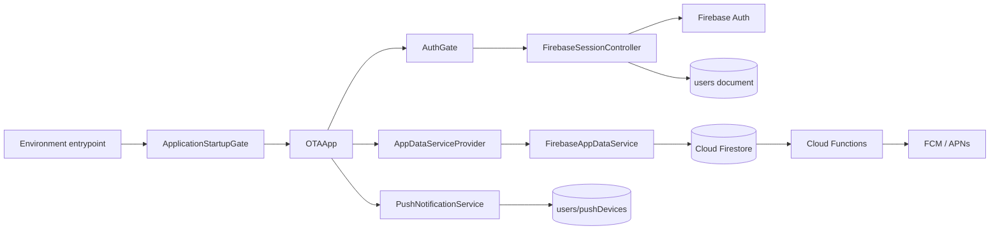
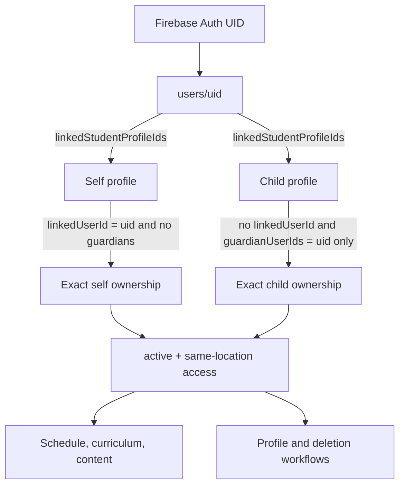
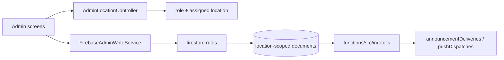
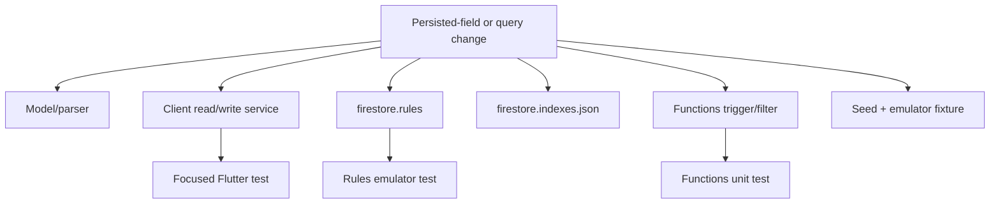
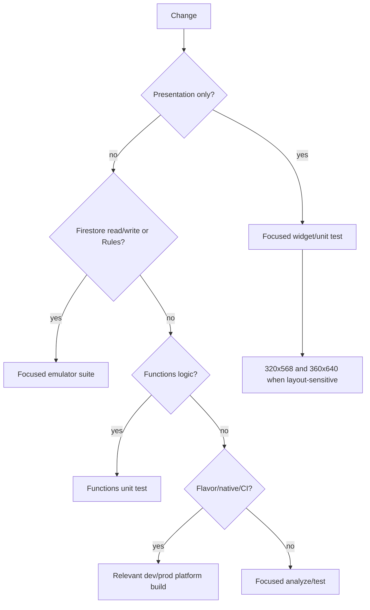

# Codebase Guide

This is the implementation companion to the repository [README](../README.md). The README explains what the Olympic Taekwondo Academy application does and why it evolved this way; this guide explains where the current behavior lives, how the pieces interact, and what must be reviewed together when it changes.

The guide describes the source at this branch. File names are deliberately explicit so a maintainer can search this page before editing an unfamiliar subsystem. Firestore Rules and backend checks remain the authorization boundary; a screen condition or route redirect is never a security control by itself.

## Contents

- [System relationships](#system-relationships)
- [Entrypoints and application shell](#entrypoints-and-application-shell)
- [Domain models](#domain-models)
- [Data contract and shared services](#data-contract-and-shared-services)
- [Firebase runtime services](#firebase-runtime-services)
- [Firestore maintenance services](#firestore-maintenance-services)
- [Bundled data](#bundled-data)
- [Member and account screens](#member-and-account-screens)
- [Administrator screens](#administrator-screens)
- [Shared presentation code](#shared-presentation-code)
- [Firestore and Firebase configuration](#firestore-and-firebase-configuration)
- [Cloud Functions](#cloud-functions)
- [Android integration](#android-integration)
- [iOS integration](#ios-integration)
- [Continuous integration](#continuous-integration)
- [Test map](#test-map)
- [Developer tools and historical artifacts](#developer-tools-and-historical-artifacts)
- [Change-impact checklist](#change-impact-checklist)

## System relationships

### Runtime data flow



`OTAApp` owns the long-lived session, live-data, push, selected-profile, and navigation coordination objects. Screens consume those objects rather than initializing Firebase clients themselves. `AppDataService` separates presentation reads from the live implementation and keeps deterministic mock/test data possible.

### Member and family ownership flow



The duplicated link fields are intentional denormalization. Safe family mutations validate both directions, exact ownership shape, active state, and location. A mere ID in `linkedStudentProfileIds` is insufficient authorization.

### Administrative write path



An administrator chooses only an authorized location. `FirebaseAdminWriteService` creates normalized payloads, but Rules independently enforce role, location, immutable fields, supported state transitions, ownership, and targeted-delivery invariants.

## Entrypoints and application shell

| File | Role and change notes |
| --- | --- |
| `lib/main.dart` | Deliberately refuses an ambiguous launch. Use an environment-specific target; do not turn this into a silent dev or production default. |
| `lib/main_dev.dart` | Development entrypoint. Selects `AppEnvironment.dev`, uses `DevelopmentFirebaseOptions`, and enters common bootstrap. |
| `lib/main_prod.dart` | Production entrypoint. Selects `AppEnvironment.prod`, uses `ProductionFirebaseOptions`, and enters common bootstrap. |
| `lib/app_environment.dart` | Defines `AppEnvironment` and `AppEnvironmentConfig`, including the expected Firebase project identity. Environment assertions should remain fail closed. |
| `lib/firebase_options_dev.dart` | Generated-style Firebase client options for the development project. Coordinate any regeneration with native client files and project-ID checks. |
| `lib/firebase_options_prod.dart` | Production Firebase client options. Treat identifiers as environment configuration, not proof that a live service has been deployed. |
| `lib/app_bootstrap.dart` | Initializes Flutter/Firebase, verifies the selected project, configures runtime dependencies, and renders `ApplicationStartupGate` while startup progresses or fails. Tests inject bootstrap operations here. |
| `lib/app.dart` | `OTAApp`, the root stateful widget. Owns routing, session/data/push lifecycles, selected profile, pending push navigation, observers, and provider wiring. Changes often affect auth, foreground/background notifications, and widget tests together. |
| `lib/routes.dart` | Canonical named-route constants. Keep push destinations, route authorization, and navigation tests aligned when names change. |

The following binaries are isolated maintenance entrypoints, not normal application routes:

| File | Capability |
| --- | --- |
| `lib/firestore_audit_main.dart` | Runs and displays the read-only Firestore audit; refuses release-mode use. |
| `lib/firestore_export_main.dart` | Produces a read-only structured database export for inspection; refuses release-mode use. |
| `lib/firestore_cleanup_main.dart` | Presents cleanup planning, warnings, explicit confirmation, execution, and post-run audit. It is write-capable and guarded. |
| `lib/firestore_schema_update_main.dart` | Runs only approved, named schema updates through the schema-update service. It is write-capable. |
| `lib/seed_firestore_main.dart` | Development seeding UI backed by `FirestoreSeedService`. Verify the Firebase target before running. |

## Domain models

Models parse persisted fields, supply compatibility defaults where intended, and expose values used by UI and business services. If a serialized field changes, review its model, all queries, admin writes, Rules, indexes, Functions, seed/test fixtures, and deletion behavior.

| File | Principal types and persisted concept |
| --- | --- |
| `lib/models/user_account.dart` | `UserAccountRole`, `UserAccount`, and profile defaults for `users/{uid}` identity, role, location, linked profiles, and account state. |
| `lib/models/student.dart` | `Student`, the full student-profile representation including relationship fields, belt/progress, preferred class, and status. |
| `lib/models/student_profile.dart` | Compatibility typedef exposing `StudentProfile` as `Student`. Keep imports stable unless completing a deliberate migration. |
| `lib/models/academy_location.dart` | `AcademyLocation`, including location metadata and IANA time-zone identity. |
| `lib/models/class_session.dart` | `ClassSession`, recurring/scheduled class metadata, group eligibility, active state, and location. |
| `lib/models/academy_announcement.dart` | `AcademyAnnouncement`, publish state, audience metadata, priority, timestamps, and location. |
| `lib/models/notification_item.dart` | `NotificationItem`, `NotificationCategory`, and `NotificationPriority` used to present announcements/events/resources and read state uniformly. |
| `lib/models/academy_event.dart` | `AcademyEvent`, event lifecycle, local date/time, details, and optional primary registration resource. |
| `lib/models/academy_resource.dart` | `AcademyResource`, resource type, publication/archive state, content/link data, and location. |
| `lib/models/curriculum_requirement.dart` | `CurriculumRequirement`, `CurriculumSection`, `CurriculumItem`, and content types for bundled belt curriculum. |

## Data contract and shared services

### App data abstraction

#### `lib/services/app_data_service.dart`

`AppDataService` is the read-facing contract consumed by the member and admin presentation layers. It exposes accounts/profiles, locations, schedule, announcements/notifications, events, resources, loading/error state, selected-profile behavior, and refresh/listening operations. It extends `Listenable`, allowing the widget tree to react to live changes without importing Firestore throughout the UI.

When adding a read surface, update the contract, `FirebaseAppDataService`, `MockAppDataService`, provider wiring, and affected tests together. Do not hide a privileged write inside this contract merely for UI convenience.

#### `lib/services/app_data_service_provider.dart`

Provides the active `AppDataService` through the widget tree and rebuilds dependents on notifications. This is the main dependency lookup used by screens. A missing provider usually means a test harness or route was constructed outside the application shell.

#### `lib/services/mock_app_data_service.dart`

Deterministic in-memory implementation used for isolated presentation work and tests. It relies on bundled `lib/data/` fixtures. Authenticated production startup must not fall back to it when Firebase reads fail.

### Shared business and runtime helpers

| File | Responsibility, dependencies, and risk |
| --- | --- |
| `lib/services/announcement_audience.dart` | Centralizes current audience labels/normalization and matching compatibility. Current client writes are `everyone`, `belt`, `classType`, or `students`; legacy values are read only where explicitly supported. Coordinate with Rules, Functions, queries, and announcement tests. |
| `lib/services/class_recommendation_service.dart` | Selects the next eligible class from active same-location sessions using age/group/belt rules and the preferred-class signal. Used by dashboard/schedule. Coordinate thresholds and canonical groups with profile validation. |
| `lib/services/event_resource_rules.dart` | Validates the zero-or-one primary registration resource relationship for events while allowing intentionally readable legacy data. Used by event editing and write validation. |
| `lib/services/location_time_service.dart` | Converts and formats instants in an academy location's time zone. Admin date/time widgets and event/schedule presentation depend on it; persisted UTC/local semantics must remain consistent. |
| `lib/services/debug_view_controller.dart` | Debug-only student/admin view switching. It is a presentation aid, not an authentication or authorization mechanism. |
| `lib/services/push_runtime.dart` | Small push interfaces/runtime types that decouple registration and message handling from Firebase plugins for tests. |
| `lib/services/push_notification_service.dart` | Requests notification permission, acquires/refreshes FCM tokens, creates a stable installation ID, writes sanitized best-effort device registration under the signed-in user, handles foreground messages, and parses push destinations. Diagnostics are observable in debug builds and registration is retryable. |
| `lib/services/push_navigation_coordinator.dart` | Holds and consumes navigation destinations from notification taps, including taps received before the navigator/session is ready. Keep route constants and content lookup behavior aligned. |

## Firebase runtime services

### Session and routing

#### `lib/services/firebase/firebase_session_controller.dart`

`FirebaseSessionController` is the auth/profile state machine. It observes Firebase Auth, loads the matching `users/{uid}` document, reconciles linked profiles, derives a `SessionStage`, and notifies `AuthGate` and `OTAApp`. It distinguishes signed-out, loading, profile-creation, ready member/admin, unavailable, and error states. It also coordinates sign-out and refresh behavior.

Key dependencies are Firebase Auth, Firestore, `FirebaseAuthenticationService`, `FirestoreProfileService`, `LinkedProfileReconciler`, and role/location models. Treat listener ordering and stale async results carefully: a response from a previous UID must never become the current session. Relevant coverage includes auth navigation, sign-up transitions, identity, and session reconciliation tests.

#### `lib/services/firebase/route_authorization.dart`

Defines `RouteAccess` and maps session state/role to permitted route classes. It is defense in depth for navigation only. Firestore Rules must still reject unauthorized data access.

#### `lib/services/firebase/admin_location_controller.dart`

Maintains the effective administrator location and `AdminLocationAccess`. Location admins are confined to their assigned location; super administrators can select an available location. Debug overrides are explicitly non-production. Admin queries and writes consume this controller.

### Authentication and identity

| File | Responsibility |
| --- | --- |
| `lib/services/firebase/firebase_authentication_service.dart` | Wraps email/password and Google authentication, maps provider errors to stable `AuthenticationError` values, and exposes account methods used by login/sign-up/session flows. |
| `lib/services/firebase/firebase_identity_contract.dart` | Normalizes provider identities and resolves trusted name/email/photo data without overwriting established profile truth with empty or weak provider values. Used during account creation and reconciliation. |
| `lib/services/firebase/apple_authentication.dart` | Creates nonce/state-safe native Apple authorization requests, converts results for Firebase, preserves the one-time Apple identity fields, handles cancellation, and supports Apple authorization-code revocation during deletion. |
| `lib/services/firebase/linked_profile_reconciler.dart` | Resolves the account's linked profile IDs, can load missing profile documents, preserves ordering, and reports missing/invalid resolutions rather than silently inventing profiles. |

### Live reads

#### `lib/services/firebase/firebase_app_data_service.dart`

`FirebaseAppDataService` is the production `AppDataService` implementation and the principal live-read aggregator. It opens and disposes Firestore listeners as the account, role, location, and selected profile change; parses documents into models; merges notification sources; and exposes stable loading/error state to screens.

Important query boundaries:

- Members read only published `everyone` announcement source documents plus their own `users/{uid}/announcementDeliveries` target materializations. The service merges and deduplicates those streams.
- Notification read state comes from `users/{uid}/notificationReads`; push device registration is handled separately.
- Schedule, events, and resources are location-scoped and filtered to states a member may see. Admin reads include authorized management states.
- Super-administrator content still requires an explicitly selected effective location.
- Listener replacement must clear stale data and suppress late callbacks from a previous account/location/profile.

This file depends on most domain models plus audience, time, reconciliation, and notification-error helpers. A query change commonly requires a matching `firestore.indexes.json` update and emulator coverage. High-value tests cover targeted delivery, routing/multilocation, notification failures, focused profiles, and release push behavior.

### Member profile and family writes

#### `lib/services/firebase/profile_service.dart`

`FirestoreProfileService` owns account/profile creation and subsequent family/profile mutations. Its input/plan types separate form data from the transaction payload. Core invariants include:

- public account roles are parent or student; administrative roles are not self-assigned;
- the account holder is at least 16;
- a self profile has `linkedUserId == uid` and no guardians;
- a child has no `linkedUserId` and exactly one guardian matching the parent UID;
- profiles are active, same-location, and linked in both directions;
- a parent can add at most ten child profiles (eleven total profiles when the parent also trains);
- preferred class is absent or one syntactically valid ID, then transactionally verified as active, same-location, and group-compatible;
- canonical class groups are stored; ambiguous legacy teen/adult groups are not guessed.

The service performs Firestore transactions/batches and converts expected failures into `ProfileServiceException`. Review `firestore.rules`, `UserAccount`, `Student`, profile screens, class recommendation, and profile/emulator tests with every mutation change.

### Administrative writes

#### `lib/services/firebase/firebase_admin_write_service.dart`

`FirebaseAdminWriteService` is the normalized write boundary for administrator UI. It contains typed payloads for student progress, announcements, events, resources, and class sessions. It validates the effective location and constructs server-timestamped document data; Rules revalidate every protected field.

Notable coupling:

- student progress writes keep `belt`, sticker progress (`current`, `required`, `nextRank`), and canonical curriculum ranks consistent;
- announcement audience/status changes drive delivery synchronization and push triggers;
- event registration resource validation uses the zero-or-one current model;
- schedule edits preserve canonical group/location semantics; bulk schedule actions are preview-only in the current UI;
- archive transitions are intentionally narrow, especially for legacy resources/events.

Used directly by the seven admin management surfaces. Test both client payload behavior and Rules rejection; a successful SDK call in a mock is not security proof.

### Account deletion

#### `lib/services/firebase/account_deletion_service.dart`

`AccountDeletionService` coordinates reauthentication, provider-specific proof, bounded Firestore destruction, and final Firebase Auth deletion. Password, Google, and Apple are supported; Apple authorization is revoked before destructive work. Admin and super-admin deletion is blocked by policy.

Deletion is resumable:

1. Reauthenticate and, for Apple, revoke the authorization code.
2. Delete private user subcollections in bounded chunks.
3. Mark `accountDeletionInProgress` on the user document.
4. Mutate each exactly owned profile in its own bounded transaction using `profileMutationId` as an idempotency/recovery marker.
5. Delete the user document, then delete the Auth user.
6. If Firestore deletion already completed, a retry may finish Auth-only cleanup; partial profile work can resume safely.

`FirestoreAccountDeletionStore` implements the database operations and is tightly coupled to Rules access-call budgets, ownership shape, private subcollection names, and the maximum family size. Review the deletion screen, Rules, emulator suite, and service tests before altering order or fields.

### Error adapter

`lib/services/firebase/notification_read_exception.dart` maps Firestore/Firebase failures for notification-read mutations into a small `NotificationReadError` taxonomy suitable for UI and tests.

## Firestore maintenance services

These services are intentionally separate from the normal runtime. Read-only tools are safer but can still expose sensitive data in output. Write-capable tools require an explicit target, reviewed plan, and controlled operator action; source presence is not permission to run them.

| File | Mode and responsibility |
| --- | --- |
| `lib/services/firestore/firestore_collections.dart` | Canonical top-level collection-name constants used by maintenance code. Update only with a complete schema migration plan. |
| `lib/services/firestore/firestore_audit_service.dart` | Read-only scanner that emits typed collection reports and severity-ranked issues. The checked-in JSON report is a historical snapshot, not live truth. |
| `lib/services/firestore/firestore_export_service.dart` | Read-only collection/document exporter for inspection and backup-style JSON output; it is not an official managed Firestore backup. |
| `lib/services/firestore/firestore_cleanup_service.dart` | Builds reviewed cleanup operations, risk levels, guardian-resolution decisions, warnings, unresolved findings, and results. Supports field updates/deletions with post-operation audit. |
| `lib/services/firestore/firestore_migration_service.dart` | Implements bounded legacy normalization for users, profiles/guardians, groups, resources, and locations. Migration result types make partial outcomes visible. |
| `lib/services/firestore/firestore_schema_update_service.dart` | Executes an allow-listed `ApprovedSchemaUpdateOperation`; designed to prevent arbitrary schema mutation from the UI wrapper. |
| `lib/services/firestore/firestore_seed_service.dart` | Writes deterministic development data for supported collections. Never aim it at production simply because the build can reach that project. |

## Bundled data

| File | Current purpose |
| --- | --- |
| `lib/data/sample_curriculum.dart` | The bundled production curriculum and local admin-form representation. Despite the historical `sample_` name, it is the current curriculum source. Its canonical belt order runs from No Belt through Black and its `nextRank` values must match progress writes. |
| `lib/data/sample_constants.dart` | Shared fixture labels/constants used by other bundled data and deterministic modes. |
| `lib/data/sample_schedule.dart` | Mock schedule fixture for isolated UI/tests. |
| `lib/data/sample_events.dart` | Mock event fixture. |
| `lib/data/sample_notifications.dart` | Mock notification fixture. |
| `lib/data/sample_resources.dart` | Mock resource fixture. |
| `lib/data/sample_student.dart` | Mock account/student/profile fixture. |

Only curriculum is intentionally authoritative production content here. Other `sample_*` data supports mocks, previews, or tests and must not become fallback data for an authenticated user after a live read failure.

## Member and account screens

### Authentication and onboarding

| File | Screen responsibility |
| --- | --- |
| `lib/screens/welcome_screen.dart` | Public landing and entry to login/sign-up. |
| `lib/screens/login_screen.dart` | Email/password, Google, and Apple sign-in plus password reset and mapped auth failures. |
| `lib/screens/signup_screen.dart` | Creates the Firebase credential and transitions into the profile-creation session; does not expose privileged roles. |
| `lib/screens/auth/auth_gate.dart` | Converts `SessionStage` into loading, onboarding, ready, unavailable, or error UI and redirects roles to the correct shell. |
| `lib/screens/auth/profile_creation_screen.dart` | Collects location, parent/student role, self profile, and optional children; submits a `ProfileCreationRequest` and handles field/service validation. |
| `lib/screens/auth/account_ready_screen.dart` | Completion/transition screen after account and profile creation. |
| `lib/screens/content_unavailable_screen.dart` | Safe explanation when authenticated content cannot be made available for the current account/session. |

### Member experience

| File | Screen responsibility |
| --- | --- |
| `lib/screens/student_dashboard_screen.dart` | Selected-profile overview: next eligible class, belt/sticker progress, notifications, and quick actions. |
| `lib/screens/schedule_screen.dart` | Location-aware day/week schedule, eligibility/recommendation, preferred class, local time, and class details. |
| `lib/screens/curriculum_screen.dart` | Bundled belt curriculum sections/items with text and embedded YouTube presentation. |
| `lib/screens/notifications_screen.dart` | Merged announcement/event/resource notification feed with read/importance filtering and load/error states. |
| `lib/screens/notification_detail_screen.dart` | Content detail and read-state transition for a notification destination. |
| `lib/screens/events_screen.dart` | Published event calendar/detail, local times, registration-resource relationship, and external/copyable links. |
| `lib/screens/resources_screen.dart` | Routes between student resource landing and general resource listing. |
| `lib/screens/resource_detail_screen.dart` | Published resource body/metadata and guarded external link launch. |
| `lib/screens/profile_screen.dart` | Account, selected student, belt, family, academy, settings, debug push diagnostics, and deletion entrypoint. |
| `lib/screens/manage_profiles_screen.dart` | Parent account/contact and exactly owned self/child profile management. |
| `lib/screens/account_deletion_screen.dart` | Provider-specific reauthentication, destructive summary/confirmation, privileged-role refusal, retry, and deletion result UI. |

Profile-dependent routes must handle a removed, inactive, missing, or unauthorized selected profile without leaking another profile's cached data.

## Administrator screens

| File | Read/write surface and coupling |
| --- | --- |
| `lib/screens/admin/admin_dashboard_screen.dart` | Location-scoped management summary and links to the admin surfaces. |
| `lib/screens/admin/admin_students_screen.dart` | Student search/filter/detail and belt/sticker progress editing. It derives self/child relationship type and uses typed admin progress writes. |
| `lib/screens/admin/admin_schedule_screen.dart` | Class-session list/editor with canonical groups, dates/times, status, eligibility fields, and preview-only bulk impact UI. |
| `lib/screens/admin/admin_announcements_screen.dart` | Draft/publish/archive management, priority, and supported audiences (`everyone`, `belt`, `classType`, `students`) including target selection. Publishing couples to Functions. |
| `lib/screens/admin/admin_events_screen.dart` | Draft/published/past event management, location time, and optional primary registration resource. |
| `lib/screens/admin/admin_resources_screen.dart` | General-resource draft/publish/archive management and validation. Also exposes the admin general-resource view. |
| `lib/screens/admin/admin_profile_screen.dart` | Administrator identity, effective location, and settings/profile presentation. |

All admin screens depend on `AdminLocationController`, live data, and `FirebaseAdminWriteService`. Visibility is not permission: Rules enforce the same location and role constraints at the database boundary.

## Shared presentation code

### Navigation, scaffolding, and forms

| File | Shared component |
| --- | --- |
| `lib/widgets/admin/admin_bottom_nav_bar.dart` | Responsive admin navigation, shell, header, destinations, and compatibility typedef. |
| `lib/widgets/admin/admin_location_selector.dart` | Effective-location selector for authorized super-admin/location-admin contexts. |
| `lib/widgets/ota_bottom_nav_bar.dart` | Member bottom-navigation destinations and rendering. |
| `lib/widgets/ota_branded_scaffold.dart` | Branded/auth page scaffold and responsive layout foundation. |
| `lib/widgets/ota_logo_mark.dart` | Reusable OTA logo mark drawn by Flutter presentation code. |
| `lib/widgets/ota_action_button.dart` | Primary/secondary action button with consistent disabled/loading presentation. |
| `lib/widgets/ota_auth_text_field.dart` | Auth form field conventions. |
| `lib/widgets/ota_auth_switch_link.dart` | Login/sign-up switching prompt. |
| `lib/widgets/unsaved_changes_guard.dart` | Back-navigation confirmation for dirty edit forms. |
| `lib/widgets/location_date_time_field.dart` | Location-aware date/time form display. |
| `lib/widgets/schedule_time_field.dart` | Schedule time editing helper. |

### Feature widgets and visual system

| File | Shared component |
| --- | --- |
| `lib/widgets/notifications/notification_card.dart` | Notification row/card, category and importance presentation. |
| `lib/widgets/profile/profile_section.dart` | Reusable profile section, information row, and action row. |
| `lib/widgets/profile/profile_edit_sheets.dart` | Account contact, student, child, parent-self, and preferred-class edit forms; submits typed `ProfileService` inputs. |
| `lib/widgets/resources/resources_landing_view.dart` | Member/admin resource-category landing cards. |
| `lib/widgets/resources/general_resources_view.dart` | Published general-resource list/cards. |
| `lib/theme/ota_colors.dart` | Central application color tokens. Preserve contrast and semantic usage when changing the palette. |
| `lib/utils/notification_formatters.dart` | Shared dates, labels, and display formatting for notification content. |

Responsive regressions are most likely in dense headers, row actions, edit sheets, schedule timelines, and admin tables. The focused layout test exercises 320x568 and 360x640 viewports with increased text scale.

## Firestore and Firebase configuration

### Database contract

| File | Responsibility |
| --- | --- |
| `firestore.rules` | Authoritative client-access policy for users, profiles, locations, sessions, announcements, deliveries, notification reads, devices, events, resources, and dispatch bookkeeping. It encodes exact ownership, role/location, allowed fields, transitions, and bounded deletion rules. |
| `firestore.indexes.json` | Composite indexes required by current location/status/audience/order queries. Query and index changes ship together. |
| `firebase.json` | Firebase CLI deployment/emulator configuration for Rules, indexes, Functions, and emulator ports. |
| `.firebaserc` | Named Firebase project aliases. Always verify the selected project instead of relying on the alias name alone. |

Major collections are `locations`, `users`, `studentProfiles`, `classSessions`, `announcements`, `events`, `resources`, and `pushDispatches`. Private user subcollections are `notificationReads`, `pushDevices`, and `announcementDeliveries`.

### Rules review map



Rules helper access counts matter. In particular, account deletion was split into bounded profile mutations so transactions remain within Firestore Rules limits. Avoid adding repeated `get()`/`exists()` calls to a hot path without emulator validation.

## Cloud Functions

The TypeScript package under `functions/` targets Node.js 22. `functions/package.json`, `functions/package-lock.json`, and `functions/tsconfig.json` define the deploy/runtime toolchain. Keep the lockfile reviewed and committed; audit findings in transitive packages must be evaluated against the deployed dependency graph rather than silently ignored.

### `functions/src/index.ts`

Exports three Firestore v2 document-written triggers:

- `pushPublishedAnnouncement`
- `pushPublishedEvent`
- `pushPublishedResource`

Each reacts to the first meaningful publication transition. Announcement handling also synchronizes per-user targeted delivery documents. Trigger configuration uses `us-east1`, retry behavior, and a bounded instance count. The trigger layer loads before/after state, obtains the dispatch lease, resolves recipients/content, sends, and records the result.

### `functions/src/push_logic.ts`

Contains testable pure and backend helper logic: publication-transition detection, supported/legacy audience interpretation, target resolution, exact family/location considerations, device-token collection, payload shaping, lease/outcome logic, FCM batches of at most 500, and invalid-token cleanup decisions.

`pushDispatches` provides an idempotency/lease boundary; the active lease window is five minutes so retries or duplicate events do not freely resend. Device documents remain user-private. Registration and delivery are best effort: durable in-app content is the source of truth even when push permission, token refresh, APNs, or FCM fails.

### `functions/test/push_logic.test.ts`

Node tests cover the extracted publication, audience, dispatch, payload, and token logic without deploying Functions. Rules emulator tests separately prove client access to device/delivery/dispatch paths.

## Android integration

| File or group | Responsibility and invariant |
| --- | --- |
| `android/app/build.gradle.kts` | Defines dev/prod product flavors, application IDs, Flutter targets, Google Services, release signing, and build types. Production release signing reads external `key.properties` values and fails closed if missing; it must never fall back to debug signing. |
| `android/build.gradle.kts`, `android/settings.gradle.kts`, `android/gradle.properties` | Root plugin repositories/versions, modules, and Gradle properties. Keep compatible with Flutter's supported Android toolchain. |
| `android/gradle/wrapper/gradle-wrapper.properties`, `android/gradle/wrapper/gradle-wrapper.jar`, `android/gradlew`, `android/gradlew.bat` | Tracked Gradle 9.1 wrapper. Wrapper JAR/scripts are supply-chain artifacts and should change only as a reviewed set. |
| `android/key.properties.example` | Template for external signing paths/aliases. Real keys and secrets do not belong in Git. |
| `android/app/src/dev/google-services.json` | Development Firebase Android client for `com.otamanagement.app`. |
| `android/app/src/prod/google-services.json` | Production Firebase Android client for `com.otacheshire.app`. |
| `android/app/src/main/AndroidManifest.xml` | Shared app manifest, notification metadata/capabilities, and Flutter activity configuration. |
| `android/app/src/debug/AndroidManifest.xml`, `android/app/src/profile/AndroidManifest.xml` | Non-release network/debug/profile overrides. Do not infer production capability from these manifests. |
| `android/app/src/main/kotlin/com/otamanagement/app/MainActivity.kt` | Flutter Android host activity. Its package aligns with the source namespace while flavor application IDs distinguish installed apps. |
| `android/app/src/main/res/drawable/ic_stat_ota.xml` | Monochrome notification status icon used by Android push presentation. |
| `android/app/src/main/res/drawable/launch_background.xml`, `android/app/src/main/res/drawable-v21/launch_background.xml`, `android/app/src/main/res/values/styles.xml`, `android/app/src/main/res/values-night/styles.xml` | Launch theme/background behavior across Android versions and light/dark modes. |
| `android/app/src/main/res/mipmap-*/ic_launcher.png` | Density-specific launcher icons; replace as a complete generated asset set. |

The Gradle flavor tasks pin `lib/main_dev.dart` or `lib/main_prod.dart` so an incorrectly supplied default target cannot silently select an environment. A local development build and a production release are different trust paths.

## iOS integration

| File or group | Responsibility and invariant |
| --- | --- |
| `ios/Runner.xcodeproj/project.pbxproj` | Xcode build configurations, bundle identifiers, Flutter targets, entitlements, Firebase copy phase, and file membership. Review carefully because manual edits are fragile. |
| `ios/Runner.xcodeproj/xcshareddata/xcschemes/dev.xcscheme`, `ios/Runner.xcodeproj/xcshareddata/xcschemes/prod.xcscheme`, `ios/Runner.xcodeproj/xcshareddata/xcschemes/Runner.xcscheme` | Shared schemes. Dev/prod select the matching configuration and Flutter target; Runner is the base Flutter scheme. |
| `ios/scripts/copy_firebase_config.sh` | Build-phase selector for the environment-specific Google service plist. It validates/copies the chosen input instead of committing one ambiguous root config. |
| `ios/Firebase/prod/GoogleService-Info.plist` | Production Firebase iOS client for bundle ID `com.otacheshire.app`. |
| `ios/Firebase/dev/` | Expected home of the development `GoogleService-Info.plist`; it is intentionally not committed and must be supplied locally for dev iOS Firebase builds. |
| `ios/Runner/Info.plist`, `ios/Runner/Info-Prod.plist` | Shared/dev and production metadata, URL schemes, background remote-notification mode, and environment-specific Google reverse-client scheme. |
| `ios/Runner/Runner.entitlements` | Enables Apple sign-in and APNs environment capability. Provisioning must match these capabilities. |
| `ios/Runner/AppDelegate.swift`, `ios/Runner/SceneDelegate.swift`, `ios/Runner/Runner-Bridging-Header.h` | Flutter/iOS host lifecycle and plugin bridge files. Notification and auth plugins ultimately depend on this native host. |
| `ios/Flutter/Debug.xcconfig`, `ios/Flutter/Release.xcconfig`, `ios/Flutter/AppFrameworkInfo.plist` | Flutter-generated/base build settings and framework metadata. Environment variables such as `APP_ENVIRONMENT` and `FLUTTER_TARGET` flow through Xcode configuration. |
| `ios/Runner/Base.lproj/LaunchScreen.storyboard`, `ios/Runner/Base.lproj/Main.storyboard` | Native startup and Flutter host storyboards. |
| `ios/Runner/Assets.xcassets/AppIcon.appiconset/`, `ios/Runner/Assets.xcassets/LaunchImage.imageset/` | iOS launcher and launch assets; update Contents metadata and all required sizes together. |
| `ios/RunnerTests/RunnerTests.swift` | Default native unit-test target placeholder; substantive behavior is currently tested in Flutter/Node/emulator suites. |

Apple sign-in requires matching Apple Developer capability, identifiers, Firebase provider setup, and provisioning. Push similarly requires APNs credentials and Firebase configuration. Files in the repository document client intent; they do not confirm console-side setup or live deployment.

## Continuous integration

| File | Trigger and purpose |
| --- | --- |
| `.github/workflows/build-apk-release.yml` | Manually builds the development debug flavor/target and publishes the artifact through a GitHub Release workflow. It is not a signed production release pipeline. |
| `.github/workflows/validate-prod.yml` | Manual and pull-request validation of the production flavor/target using a debug APK. It catches configuration/compilation drift without requiring production signing material. |

Both workflows install the pinned Flutter/Java dependencies declared in workflow YAML and rely on the tracked Dart and Gradle lock/wrapper artifacts. `pubspec.lock` is intentionally versioned for application reproducibility. Keep workflow claims precise: a green debug build does not prove store signing, APNs delivery, Firebase console policy, or a production deployment.

## Test map

### Flutter tests: startup, auth, identity, and profiles

| Test file | Primary contract |
| --- | --- |
| `test/app_bootstrap_test.dart` | Startup sequencing, environment checks, and failure UI. |
| `test/auth_navigation_test.dart` | Auth/session route outcomes. |
| `test/signup_session_transition_test.dart` | Credential creation through profile-onboarding transition. |
| `test/firebase_authentication_service_test.dart` | Provider wrappers and stable error mapping. |
| `test/firebase_identity_contract_test.dart` | Provider identity normalization and precedence. |
| `test/apple_authentication_test.dart` | Nonce/request/result/cancellation Apple coordination. |
| `test/firebase_session_reconciliation_test.dart` | Auth-user document/profile listener reconciliation and stale-result safety. |
| `test/profile_creation_screen_test.dart` | Onboarding forms, role/age/family validation, and submission. |
| `test/profile_service_test.dart` | Profile creation/edit transaction plans and invariants. |
| `test/profile_management_regression_test.dart` | Family-management mutation regressions. |
| `test/parent_self_profile_screen_test.dart` | Parent-as-student creation/edit presentation. |
| `test/admin_student_relationship_test.dart` | Admin derivation of self/child relationship shapes. |
| `test/access_routing_multilocation_test.dart` | Role and location scoping across routes/data. |

### Flutter tests: content, push, admin, and layout

| Test file | Primary contract |
| --- | --- |
| `test/firebase_announcement_delivery_test.dart` | Everyone source plus targeted delivery merging/deduplication. |
| `test/announcement_audience_test.dart` | Audience normalization, labels, and compatibility. |
| `test/notification_read_exception_test.dart` | Read-state error taxonomy. |
| `test/focused_profile_notification_test.dart` | Notification behavior while switching/using the focused profile. |
| `test/foreground_push_notification_test.dart` | Foreground message presentation. |
| `test/release_push_regression_test.dart` | Registration/destination behavior important to release builds. |
| `test/class_recommendation_test.dart` | Eligibility and next-class selection. |
| `test/admin_schedule_preferred_class_test.dart` | Preferred-class behavior across schedule editing/selection. |
| `test/admin_student_progress_test.dart` | Belt/sticker/next-rank admin payload behavior. |
| `test/curriculum_admin_test.dart` | Curriculum and admin progress consistency. |
| `test/layout_overflow_regression_test.dart` | Narrow-screen and increased-text-scale smoke coverage. |
| `test/widget_test.dart` | Broad application widget smoke test. |

### Flutter tests: deletion and maintenance tooling

| Test file | Primary contract |
| --- | --- |
| `test/account_deletion_screen_test.dart` | Deletion confirmation, reauth choices, privileged refusal, and results. |
| `test/account_deletion_service_test.dart` | Provider proof, bounded order, retries, and recovery markers. |
| `test/firestore_audit_test.dart` | Audit classifications/report structure. |
| `test/firestore_export_test.dart` | Read-only export shape. |
| `test/firestore_cleanup_test.dart` | Cleanup planning, warnings, resolution, execution, and audit. |
| `test/documentation_test.dart` | Historical documentation presence/content contract. When documentation is consolidated, update this test in a code-enabled change; do not weaken it silently. |

### Firestore Rules emulator suites

The Node harness under `tool/firebase_emulator_tests/` has its own `package.json` and `package-lock.json`. `client_workflows.js` provides shared authenticated/unauthenticated clients, seed helpers, and assertions.

| Test file | Primary contract |
| --- | --- |
| `tool/firebase_emulator_tests/firestore_workflows.test.js` | Core member/admin reads and writes, roles, locations, and collection rules. |
| `tool/firebase_emulator_tests/account_deletion.test.js` | Exact ownership, bounded profile mutations, private cleanup, retry, and privileged-account denial. |
| `tool/firebase_emulator_tests/admin_student_progress.test.js` | Allowed progress fields, canonical belt/sticker/next-rank consistency, and rejection cases. |
| `tool/firebase_emulator_tests/push_devices.test.js` | Owner-only device registrations, delivery visibility, and dispatch protection. |
| `tool/firebase_emulator_tests/removal_migration.test.js` | Compatibility/removal migration constraints and legacy-shape behavior. |

### Functions tests

`functions/test/push_logic.test.ts` verifies pure delivery logic. It complements, but does not replace, emulator tests for access control or an end-to-end device check for Firebase/APNs/FCM configuration.

### Choosing validation



Run the narrow layout regression at 1.0x and 1.5x text scale when changing dense responsive UI. For Firestore writes, a targeted emulator test with realistic supporting documents is more informative than relying only on a broad mock suite. If the emulator cannot find Java on Windows, add Android Studio's bundled JBR `bin` directory to that command's `PATH`.

## Developer tools and historical artifacts

| Path | Purpose and safety status |
| --- | --- |
| `tool/seed_firestore.dart` | Command-oriented development seed helper. Write-capable; verify environment/project and payload before use. |
| `tool/remove_approval_data.mjs` | One-off removal/migration helper from the earlier approval model. Historical and write-capable; do not treat it as routine setup. |
| `docs/firestore_audit_report.json` | Historical audit snapshot generated during the July 2026 data-quality phase. It records 139 findings (126 informational, 8 warnings, 5 errors) at that time and is retained as evidence, not a current production-health report. |

The audit report's collection names and examples help explain why cleanup/migration tooling exists. Re-run the audit deliberately against the intended project before making any current claim; never infer live resolution or live failure solely from the checked-in snapshot.

### Maintenance entrypoints and safeguards

The standard development-flavor commands are:

```powershell
# Read-only
flutter run --flavor dev -t lib/firestore_audit_main.dart
flutter run --flavor dev -t lib/firestore_export_main.dart

# Write-capable; inspect the target, source guard, plan, and confirmation first
flutter run --flavor dev -t lib/firestore_cleanup_main.dart
flutter run --flavor dev -t lib/firestore_schema_update_main.dart
flutter run --flavor dev -t lib/seed_firestore_main.dart
flutter run --flavor dev -t tool/seed_firestore.dart

# Historical approval-data removal: dry-run by default and development-only
node tool/remove_approval_data.mjs --project=ota-management-platform
```

Audit/export refuse release-mode operation. Cleanup first generates a deterministic plan, shows unresolved relationships and warnings, requires an exact confirmation and project match, applies field-level changes without deleting whole documents, stops at the failed document, and audits again after success. Schema updates are allow-listed in source. Seeding and migration paths have source-level enablement/target checks that must be reviewed at the commit being run; do not bypass them from a documentation command.

The historical approval-data script is scoped to the development project, requires exactly one active location and a short-lived operator token for apply mode, and does not modify Firebase Authentication users. Its dry-run output must be reviewed before using the exact confirmation shown by the script. No command here grants deployment or production-data authorization.

## Change-impact checklist

Use the smallest applicable slice, but follow every dependency edge that the change crosses.

| If changing... | Review together |
| --- | --- |
| Auth provider or identity fields | Login/sign-up, auth service, identity contract, session controller, profile creation, deletion reauth/revocation, native provider setup, tests |
| User/profile relationship fields | Models, profile service, data service queries, session reconciliation, Rules exact ownership, deletion, admin relationship UI, emulator tests |
| Role or location access | Session/route authorization, admin location controller, data queries, admin writes, Rules, emulator routing and multilocation cases |
| Announcement audience/publication | Audience helper, admin form, model, live source/delivery merge, Rules, indexes, Functions delivery and push logic, unit/emulator tests |
| Event/resource lifecycle | Models, member/admin screens, event-resource rule, admin writes, Rules/indexes, Functions publication trigger, archive compatibility tests |
| Class group, belt, progress, or preferred class | Bundled curriculum, models, recommendation, profile transactions, admin schedule/student writes, Rules, realistic seed fixtures, Flutter and emulator tests |
| Notification read/device schema | Live data service, notification adapter, push service/runtime, profile diagnostics, Rules, deletion private-subcollection cleanup, Functions token logic, tests |
| Account deletion step or field | Screen, service/auth/store, exact ownership helpers, Rules access-call budget, maximum family size, emulator and service tests |
| Firebase collection/query | Model/parser, app-data listener disposal, admin write, Rules, indexes, Functions, maintenance tools, seed/export/audit, tests |
| Dev/prod identity | Dart options/entrypoints, Android flavors and clients, iOS schemes/plists/script, Firebase aliases, workflows, both platform validation paths |
| Native push or Apple capability | Dart plugin flow, Android manifest/icon/client, iOS entitlements/plists/AppDelegate/provider setup, Firebase/APNs/Apple consoles, device validation |
| Shared responsive UI | Component consumers, unsaved/back behavior, accessibility/contrast, narrow-screen regression and affected widget tests |
| Maintenance tool | Isolated entrypoint, service preconditions/refusals, exact Firebase target, dry-run/plan output, audit before/after, focused tests |

Before merging a cross-layer change, answer these questions explicitly:

1. Which authenticated roles and locations can read or write the new shape?
2. Can a stale listener, legacy document, or duplicate trigger take the wrong branch?
3. Do Rules enforce the invariant without exceeding access-call limits?
4. Do current queries have required indexes and avoid client-side security assumptions?
5. Does account deletion remove, preserve, or safely orphan the new data?
6. Do dev and production targets select the correct client and entrypoint?
7. Is the most security-relevant behavior covered by an emulator or backend test rather than only a UI mock?

For product history, operator setup, build commands, release readiness, known limitations, and the current security model in narrative form, return to the [README](../README.md).
